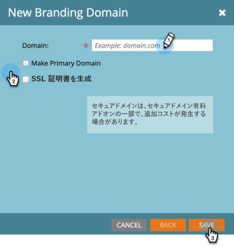

# 付加的なブランディングドメインの追加 {#add-an-additional-branding-domain}

1 つの Marketo インスタンスから複数のブランドを実行し、それぞれに独自のブランドのトラッキングリンクを持たせる場合は、ブランディングドメインを追加します。

>[!PREREQUISITES]
>
>ブランディングドメインと[一般トラッキングリンクの置き換え](/help/marketo/product-docs/administration/email-setup/add-multiple-branding-domains/edit-your-default-branding-domain.md)を行ってから、ブランディングドメインに追加する必要があります。

1. 「**管理者**」領域に移動します。

   

1. 「**メール**」をクリックします。

   

1. 「**追加**」をクリックして、ブランディングドメインを追加します。

   

1. 新しいブランディングドメイン名を入力し、「**保存**」をクリックします。

   

>[!NOTE]
>
>これをプライマリドメインにできます。既存の未送信メールはすべて「デフォルト」に設定され、新しく作成されたすべてのメールはデフォルトでプライマリドメインに設定されます。これは、[メールごとに上書きできます](/help/marketo/product-docs/administration/email-setup/add-multiple-branding-domains/overwrite-primary-domain-for-emails.md)。

>[!MORELIKETHIS]
>
>[デフォルトのブランディングドメインの編集](/help/marketo/product-docs/administration/email-setup/add-multiple-branding-domains/edit-your-default-branding-domain.md)
