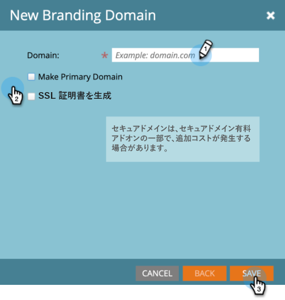

# 付加的なブランディングドメインの追加 {#add-an-additional-branding-domain}

1つのMarketo インスタンスから複数のブランドを実行し、それぞれに独自のトラッキングリンクを持たせたい場合は、さらにブランディングドメインを追加します。

>[!PREREQUISITES]
>
>ブランディングドメインと[一般トラッキングリンクの置き換え](/help/marketo/product-docs/administration/email-setup/add-multiple-branding-domains/edit-your-default-branding-domain.md){target="_blank"}を行ってから、ブランディングドメインに追加する必要があります。

1. 「**[!UICONTROL 管理者]**」領域に移動します。

   

1. 「**[!UICONTROL メール]**」をクリックします。

   

1. 「**[!UICONTROL 追加]**」をクリックして、ブランディングドメインを追加します。

   {width="600"}

1. 新しいブランディングドメインの名前を入力し、「_プライマリドメインにする_」や「_SSL 証明書を生成_」（両方ともオプション）を選択して、「**[!UICONTROL 保存]**」をクリックします。

   

>[!NOTE]
>
>* _プライマリドメインを作成_：これをプライマリドメインにし、既存の未送信メールのうち、「デフォルト」に設定されているすべてのメールと、新しく作成されたすべてのメールは、プライマリドメインにデフォルトで設定されます。 [この設定はメールごとに上書き](/help/marketo/product-docs/administration/email-setup/add-multiple-branding-domains/overwrite-primary-domain-for-emails.md){target="_blank"}できます。
>
>* _SSL 証明書を生成_：ドメインの作成に Secure Sockets Layer（SSL）を作成できます。 最初のトラッキングドメインは、数時間かかるインフラストラクチャの1回限りのセットアップを開始します。 完了すると通知が届き、最初のドメインを設定できます。 既存のドメインにSSLを追加するには、[Marketo サポート ](https://nation.marketo.com/t5/support/ct-p/Support){target="_blank"}にお問い合わせください。

## 既存のドメインのSSLの編集

既存のドメインで SSL を有効にするには、次の手順に従います。

1. _[!UICONTROL 管理者]_ エリアから、「**[!UICONTROL メール]**」を選択します。

1. 「_[!UICONTROL ドメイン]_」タブで、ドメイン行を選択し、**[!UICONTROL SSL]**&#x200B;を追加をクリックします。

   {width="600"}

1. ダイアログで、「**[!UICONTROL 確認]**」をクリックします。

   {width="400"}

## エラーメッセージ {#error-messages}

<table><thead>
  <tr>
    <th>エラー</th>
    <th>詳細</th>
  </tr></thead>
<tbody>
<tr>
    <td><i>ドメインが既に存在します。</i></td>
    <td>同じ名前のドメインが既に存在します。</td>
  </tr>
  <tr>
    <td><i>ドメインがデフォルトのドメインにマッピングされていません。</i></td>
    <td>カスタムドメインがデフォルトのドメインに正しくマッピングされていません。 ドメインマッピング設定を確認し、DNS設定が正しいデフォルトドメインを指していることを確認します。</td>
  </tr>
  <tr>
    <td><i>サポートされていないCAA レコードが原因で、SSL証明書を発行できませんでした。 IT部門にCAA レコードの更新を依頼する。</i></td>
    <td>CAA レコードが最新ではありません。 Marketo Engageで管理されたSSL証明書を使用する場合、CAA レコードをMarketo ベンダーが推奨する証明書に更新する必要があります。 CAA レコードを更新するには、IT部門にお問い合わせください。 詳細については、<a href="https://nation.marketo.com/t5/product-blogs/changes-to-marketo-engage-secured-domains-platform/ba-p/329305#M2246">このページ </a>を参照してください。</td>
  </tr>
  <tr>
    <td><i>SSL 証明書は既に発行されています。</i></td>
    <td>このカスタムドメインには、SSL 証明書が既に存在します。 証明書の有効期限が切れているか、再発行が必要な場合を除き、これ以上のアクションは必要ありません。</td>
  </tr>
  <tr>
    <td><i>デフォルトのドメインが見つかりませんでした。 サポートが必要な場合は、サポートにお問い合わせください。</i></td>
    <td>デフォルトのドメインを見つけようとした際に問題が発生しました。 調査については、サポートにお問い合わせください。</td>
  </tr>
  <tr>
    <td><i>ドメインの作成中に予期しないエラーが発生しました。 サポートが必要な場合は、サポートにお問い合わせください。</i></td>
    <td>予期しないエラーが発生しました。 ログとエラーの詳細を収集し、問題を<a href="https://nation.marketo.com/t5/support/ct-p/Support" target="_blank">Marketo サポート </a>にエスカレーションします。</td>
  </tr>
</tbody></table>

## 注意事項 {#things-to-note}

* **Marketo EngageへのドメインのDNS マッピング**: UIにドメインを追加する前に、CNAMEを[Marketoが提供するドメインにマッピングする必要があります](https://experienceleague.adobe.com/ja/docs/marketo/using/getting-started/initial-setup/setup-steps#customize-your-landing-page-urls-with-a-cname){target="_blank"}。

* **カスタム SSL**: カスタム SSLが必要な場合は、[ サポートチケット ](https://nation.marketo.com/t5/support/ct-p/Support){target="_blank"}を送信してください。 SSL 作成にセルフサービスチェックボックスを使用しないでください。

* **既存のSSL**: ドメインの追加中に、システムが既存のSSLをチェックします。これは、以前に手動で作成された可能性があります。 この検証が発生した場合は、SSL作成を選択せずにドメインを作成し、[ サポート ](https://nation.marketo.com/t5/support/ct-p/Support){target="_blank"}に連絡して接続してもらってください。

* **ドメインの削除**: ドメイン **を自動的に削除しても、SSL証明書は削除されません**。 このガードレールは、web サイトに SSL 証明書がない結果となるユーザーエラーを防ぎます。 SSL証明書を削除する場合は、[ サポートにお問い合わせください](https://nation.marketo.com/t5/support/ct-p/Support){target="_blank"}。

* 追加したドメインがCNAME以外のドメインとしてリストされている場合、ブランド化されたトラッキングドメインをさらに追加する機能はロックアウトされます。 既存のドメインを編集し、それがCNAME レコードであり、例えばA レコードでないことを確認する必要があります。 「追加」ボタンは、CNAMEのみを動的にチェックします。

>[!MORELIKETHIS]
>
>[デフォルトのブランディングドメインの編集](/help/marketo/product-docs/administration/email-setup/add-multiple-branding-domains/edit-your-default-branding-domain.md){target="_blank"}
