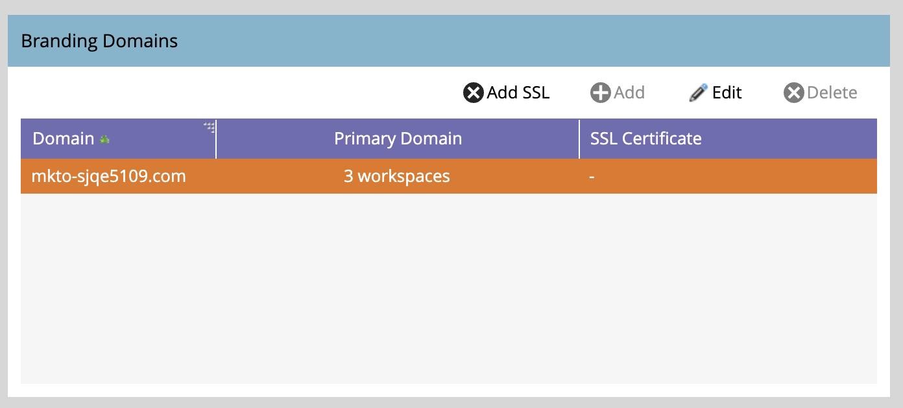

# 付加的なブランディングドメインの追加 {#add-an-additional-branding-domain}

1 つの Marketo インスタンスから複数のブランドを実行し、それぞれに独自のブランドのトラッキングリンクを持たせる場合は、ブランディングドメインを追加します。

>[!PREREQUISITES]
>
>ブランディングドメインと[一般トラッキングリンクの置き換え](/help/marketo/product-docs/administration/email-setup/add-multiple-branding-domains/edit-your-default-branding-domain.md){target="_blank"}を行ってから、ブランディングドメインに追加する必要があります。

1. 「**[!UICONTROL 管理者]**」領域に移動します。

   

1. 「**[!UICONTROL メール]**」をクリックします。

   

1. 「**[!UICONTROL 追加]**」をクリックして、ブランディングドメインを追加します。

   {width="600"}

1. 新しいブランディングドメインの名前を入力し、「_プライマリドメインにする_」や「_SSL 証明書を生成_」（両方ともオプション）を選択して、「**[!UICONTROL 保存]**」をクリックします。

   

>[!NOTE]
>
>* _プライマリドメインにする_：これをプライマリドメインにします。既存の未送信メールはすべて「デフォルト」に設定され、新しく作成されたすべてのメールはデフォルトでプライマリドメインに設定されます。[この設定はメールごとに上書き](/help/marketo/product-docs/administration/email-setup/add-multiple-branding-domains/overwrite-primary-domain-for-emails.md){target="_blank"}できます。
>
>* _SSL 証明書を生成_：ドメインの作成に Secure Sockets Layer（SSL）を作成できます。最初のトラッキングドメインでは、インフラストラクチャの 1 回限りの設定が開始しますが、これには数時間かかる場合があります。完了すると通知が届き、最初のドメインを設定できます。既存のドメインに SSL を追加するには、[Marketo サポート](https://nation.marketo.com/t5/support/ct-p/Support){target="_blank"}にお問い合わせください。

## 既存のドメインの SSL の編集

既存のドメインで SSL を有効にするには、次の手順に従います。

1. _[!UICONTROL 管理者]_ エリアから、「**[!UICONTROL メール]**」を選択します。

1. 「_[!UICONTROL ドメイン]_」タブで、ドメイン行を選択し、「**[!UICONTROL SSL を追加]**」をクリックします。

   {width="600"}

1. ダイアログで、「**[!UICONTROL 確認]**」をクリックします。

   {width="400"}

## エラーメッセージ {#error-messages}

<table><thead>
  <tr>
    <th>エラー</th>
    <th>詳細</th>
  </tr></thead>
<tbody>
<tr>
    <td><i>ドメインが既に存在します。</i></td>
    <td>同じ名前のドメインが既に存在します。</td>
  </tr>
  <tr>
    <td><i>ドメインがデフォルトのドメインにマッピングされていません。</i></td>
    <td>カスタムドメインがデフォルトのドメインに正しくマッピングされていません。ドメインマッピング設定を確認し、DNS 設定が正しいデフォルトのドメインを指していることを確認してください。</td>
  </tr>
  <tr>
    <td><i>CAA レコードがサポートされていないので、SSL 証明書を発行できませんでした。 CAA レコードを更新するように IT にリクエストします。</i></td>
    <td>CAA レコードが最新ではありません。 Marketo Engage管理の SSL 証明書を使用している場合は、ベンダーが推奨する証明書に CAA レコードを更新する必要があります。 CAA レコードを更新するには、担当の IT 部門に問い合わせてください。 詳しくは、<a href="https://nation.marketo.com/t5/product-blogs/changes-to-marketo-engage-secured-domains-platform/ba-p/329305#M2246"> このページ </a> を参照してください。</td>
  </tr>
  <tr>
    <td><i>SSL 証明書は既に発行されています。</i></td>
    <td>このカスタムドメインには、SSL 証明書が既に存在します。証明書の有効期限が切れているか、再発行が必要な場合を除き、これ以上のアクションは必要ありません。</td>
  </tr>
  <tr>
    <td><i>デフォルトのドメインが見つかりませんでした。サポートが必要な場合は、サポートにお問い合わせください。</i></td>
    <td>デフォルトのドメインを見つけようとした際に問題が発生しました。調査いたしますので、サポートにお問い合わせください。</td>
  </tr>
  <tr>
    <td><i>ドメインの作成中に予期しないエラーが発生しました。サポートが必要な場合は、サポートにお問い合わせください。</i></td>
    <td>予期しないエラーが発生しました。ログとエラーの詳細を収集し、問題を<a href="https://nation.marketo.com/t5/support/ct-p/Support" target="_blank">Marketo サポート</a>にエスカレートしてください。</td>
  </tr>
</tbody></table>

## 注意事項 {#things-to-note}

* **ドメインから Marketo Engage への DNS マッピング**：UI でドメインを追加する前に、[Marketo 提供のドメインに CNAME をマッピング](https://experienceleague.adobe.com/ja/docs/marketo/using/getting-started/initial-setup/setup-steps#customize-your-landing-page-urls-with-a-cname){target="_blank"}する必要があります。

* **カスタム SSL**：カスタム SSL が必要な場合は、[サポートチケット](https://nation.marketo.com/t5/support/ct-p/Support){target="_blank"}を送信してください。SSL 作成にセルフサービスチェックボックスを使用しないでください。

* **既存の SSL**：ドメインの追加中に、事前に手動で作成した可能性のある既存の SSL がシステムによってチェックされます。この検証が発生した場合は、SSL 作成を選択せずにドメインを作成すると、SSL が接続されます。追加kの詳細やオプションについては、[サポートにお問い合わせください](https://nation.marketo.com/t5/support/ct-p/Support){target="_blank"}。

* **ドメインの削除**:SSL 証明書を自動的に削除 **削除しない** します。 このガードレールは、web サイトに SSL 証明書がない結果となるユーザーエラーを防ぎます。 SSL 証明書を削除する場合は、[&#x200B; サポートにお問い合わせください &#x200B;](https://nation.marketo.com/t5/support/ct-p/Support){target="_blank"}。

>[!MORELIKETHIS]
>
>[デフォルトのブランディングドメインの編集](/help/marketo/product-docs/administration/email-setup/add-multiple-branding-domains/edit-your-default-branding-domain.md){target="_blank"}
