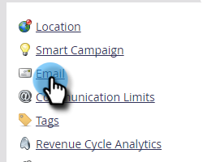

# 付加的なブランディングドメインの追加 {#add-an-additional-branding-domain}

1 つの Marketo インスタンスから複数のブランドを実行し、それぞれに独自のブランドのトラッキングリンクを持たせる場合は、ブランディングドメインを追加します。

>[!PREREQUISITES]
>
>ブランディングドメインと[一般トラッキングリンクの置き換え](/help/marketo/product-docs/administration/email-setup/add-multiple-branding-domains/edit-your-default-branding-domain.md){target="_blank"}を行ってから、ブランディングドメインに追加する必要があります。

1. 「**[!UICONTROL 管理者]**」領域に移動します。

   

1. 「**[!UICONTROL メール]**」をクリックします。

   

1. 「**[!UICONTROL 追加]**」をクリックして、ブランディングドメインを追加します。

   

1. 新しいブランディングドメインの名前を入力し、「_プライマリドメインにする_」や「_SSL 証明書を生成_」（両方ともオプション）を選択して、「**[!UICONTROL 保存]**」をクリックします。

   

>[!NOTE]
>
>* _プライマリドメインにする_：これをプライマリドメインにします。既存の未送信メールはすべて「デフォルト」に設定され、新しく作成されたすべてのメールはデフォルトでプライマリドメインに設定されます。[この設定はメールごとに上書き](/help/marketo/product-docs/administration/email-setup/add-multiple-branding-domains/overwrite-primary-domain-for-emails.md){target="_blank"}できます。
>
>* _SSL 証明書を生成_：ドメインの作成に Secure Sockets Layer（SSL）を作成できます。最初のトラッキングドメインでは、インフラストラクチャの 1 回限りの設定が開始しますが、これには数時間かかる場合があります。完了すると通知が届き、最初のドメインを設定できます。既存のドメインに SSL を追加するには、[Marketo サポート](https://nation.marketo.com/t5/support/ct-p/Support){target="_blank"}にお問い合わせください。

## エラーメッセージ {#error-messages}

<table><thead>
  <tr>
    <th>エラー</th>
    <th>詳細</th>
  </tr></thead>
<tbody>
  <tr>
    <td><i>ドメインの作成中に予期しないエラーが発生しました。サポートが必要な場合は、サポートにお問い合わせください。</i></td>
    <td>予期しないエラーが発生しました。ログとエラーの詳細を収集し、問題を <a href="https://nation.marketo.com/t5/support/ct-p/Support" target="_blank">Marketo サポート</a>にエスカレートしてください。</td>
  </tr>
  <tr>
    <td><i>SSL 証明書は既に発行されています。</i></td>
    <td>このカスタムドメインには、SSL 証明書が既に存在します。証明書の有効期限が切れているか、再発行が必要な場合を除き、これ以上のアクションは必要ありません。</td>
  </tr>
  <tr>
    <td><i>ドメインがデフォルトのドメインにマッピングされていません。</i></td>
    <td>カスタムドメインがデフォルトのドメインに正しくマッピングされていません。ドメインマッピング設定を確認し、DNS 設定が正しいデフォルトのドメインを指していることを確認してください。</td>
  </tr>
  <tr>
    <td><i>Cloudflare の設定が開始されました。後でもう一度やり直してください。</i></td>
    <td>インスタンスに対して最初のトラッキングドメインを作成すると、Cloudfare で 1 回限りのインフラストラクチャ設定が行われます。このメッセージは、設定が開始されており、最大 3 時間かかる可能性があることを示します。</td>
  </tr>
  <tr>
    <td><i>Cloudflare の設定はまだ進行中です。後でもう一度やり直してください。</i></td>
    <td>上記を参照してください</td>
  </tr>
  <tr>
    <td><i>予期しないエラーにより、Cloudflare の設定に失敗しました。カスタマーサポートにお問い合わせください。</i></td>
    <td>Cloudfare インフラストラクチャの初期設定に失敗しました。サポートが必要な場合は、<a href="https://nation.marketo.com/t5/support/ct-p/Support" target="_blank">Marketo サポート</a>にお問い合わせください。</td>
  </tr>
</tbody></table>

## 注意事項 {#things-to-note}

* **ドメインから Marketo Engage への DNS マッピング**：UI でドメインを追加する前に、[Marketo 提供のドメインに CNAME をマッピング](https://experienceleague.adobe.com/ja/docs/marketo/using/getting-started/initial-setup/setup-steps#customize-your-landing-page-urls-with-a-cname){target="_blank"}する必要があります。

* **カスタム SSL**：カスタム SSL が必要な場合は、[サポートチケット](https://nation.marketo.com/t5/support/ct-p/Support){target="_blank"}を送信してください。SSL 作成にセルフサービスチェックボックスを使用しないでください。

* **既存の SSL**：ドメインの追加中に、事前に手動で作成した可能性のある既存の SSL がシステムによってチェックされます。この検証が発生した場合は、SSL 作成を選択せずにドメインを作成すると、SSL が接続されます。追加kの詳細やオプションについては、[サポートにお問い合わせください](https://nation.marketo.com/t5/support/ct-p/Support){target="_blank"}。

* **初回のトラッキングドメイン**：メールトラッキングリンクドメインを初めて作成する場合は、[Marketo サポート](https://nation.marketo.com/t5/support/ct-p/Support){target="_blank"}による手動介入が必要になります。UI では、同じドメインでの後続のサブドメインの作成が許可されます。

* **既存のドメインへの証明書の追加**：現時点では、既存のドメインへの証明書の追加はサポートされていません。既存のドメインの場合や、SSL 証明書のボックスをオンにしなかった場合は、[Marketo サポート](https://nation.marketo.com/t5/support/ct-p/Support){target="_blank"}に連絡して、証明書を追加する必要があります。

* **既存のドメインの証明書の編集または削除**：既存の SSL を更新または削除する必要がある場合は、[Marketo サポート](https://nation.marketo.com/t5/support/ct-p/Support){target="_blank"}にお問い合わせください。

* **ドメインの削除**：現時点では、ドメインを削除しても、SSL 証明書は自動的に削除されません。これは、今後のリリースで対処される予定です。

>[!MORELIKETHIS]
>
>[デフォルトのブランディングドメインの編集](/help/marketo/product-docs/administration/email-setup/add-multiple-branding-domains/edit-your-default-branding-domain.md){target="_blank"}
