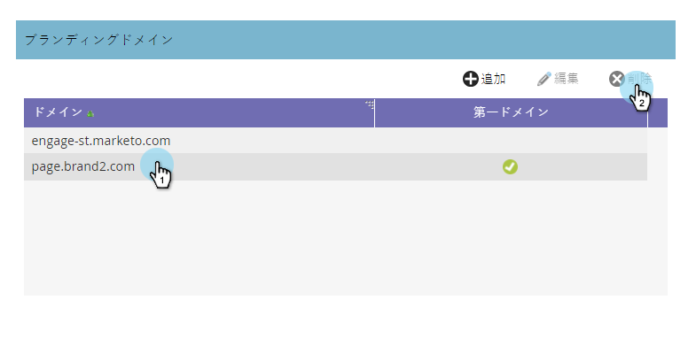

# ブランドドメインの削除{#delete-a-branding-domain}

1. 「マーケティング」で、「**管理者**」をクリックし、「**電子メール**」リンクをクリックします。

   

1. ブランドドメインテーブルで、削除するドメインを選択し、「**削除**」をクリックします。

   

   >[!NOTE]
   >
   >プライマリブランディングドメインを削除する場合は、まず、別のブランディングドメインをプライマリにする必要があります。
