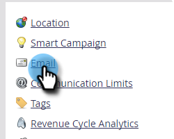
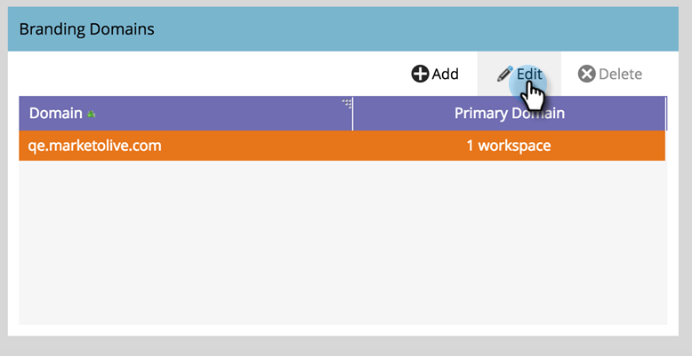

# ワークスペースを使用したデフォルトのブランディングドメインの編集 {#edit-your-default-branding-domain-with-workspaces}

1. 「**[!UICONTROL 管理者]**」領域に移動します。

   

1. 「**[!UICONTROL メール]**」をクリックします。

   

1. [!UICONTROL ブランディングドメイン]テーブルで、現在の汎用ドメインを選択し、「**[!UICONTROL 編集]**」をクリックして、会社のブランディングドメインに変更します。

   

   >[!NOTE]
   >
   >「**[!UICONTROL 追加]**」は、汎用ドメインを編集するまで機能しません。 「**[!UICONTROL 削除]**」は、2 番目のドメインを追加するまで機能しません。

1. デフォルトのドメイン名を入力し、「**[!UICONTROL 次へ]**」をクリックします。

   

1. 「**[!UICONTROL 保存]**」をクリックします。

   

>[!NOTE]
>
>追加のブランディングドメインを追加する場合は、これを1つ以上のワークスペースのプライマリドメインにすることができます。また、「デフォルト」に設定されているすべての既存の未送信メールと、新しく作成されたすべてのメールがプライマリドメインにデフォルトで設定されます。 これは、メールごとに上書きできます。

これで、ワークスペースに必要な[付加的なブランディングドメインを追加](/help/marketo/product-docs/administration/email-setup/add-multiple-branding-domains/add-an-additional-branding-domain-with-workspaces.md)できます。
