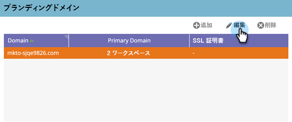

# デフォルトのブランディングドメインの編集 {#edit-your-default-branding-domain}

デフォルトのブランディングドメインの編集は、ブランディングドメインを操作する際の最初の手順です。

>[!PREREQUISITES]
>
>Marketo にブランディングドメインを追加する前に、[DNS で CNAME を設定](/help/marketo/getting-started/setup/configure-protocols-for-marketo.md)しておくようにします。

1. 「**[!UICONTROL 管理者]**」領域に移動します。

   

1. 「**[!UICONTROL メール]**」をクリックします。

   

1. 内 [!UICONTROL ブランディングドメイン] の表で、汎用ドメインを選択し、「編集」をクリックして、会社のブランディングドメインに変更します。

   

   >[!NOTE]
   >
   >最初に汎用ドメインを編集するまで、ドメインは追加できません。

1. デフォルトのドメイン名を入力し、 **[!UICONTROL 保存]**.

   

これで、必要な[追加のブランディングドメインを追加](/help/marketo/product-docs/administration/email-setup/add-multiple-branding-domains/add-an-additional-branding-domain.md)できるようになりました。
