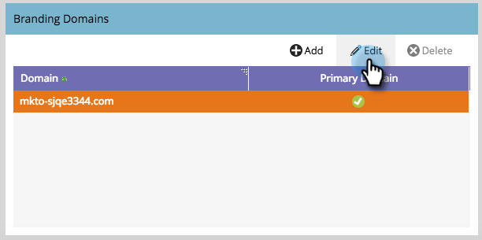

# デフォルトのブランドドメインの編集{#edit-your-default-branding-domain}

ブランドドメインを操作する際は、最初にデフォルトのブランドドメインを編集します。

>[!PREREQUISITES]
>
>Marketoにブランディングドメインを追加する前に、DNS](../../../../getting-started/setup-steps/configure-protocols-for-marketo.md)で[CNAMEを設定していることを確認してください。

1. **管理者**&#x200B;に移動し、**電子メール**&#x200B;をクリックします。

   

1. 「ブランドドメイン」テーブルで、汎用ドメインを選択し、「編集」をクリックして会社のブランドドメインに変更します。

   

   >[!NOTE]
   >
   >汎用ドメインを最初に編集するまで、追加のドメインを追加することはできません。

1. デフォルトドメインの名前を入力し、「保存」をクリックします。

   e

これで、[必要な追加のブランドドメイン](add-an-additional-branding-domain.md)を追加できます。

