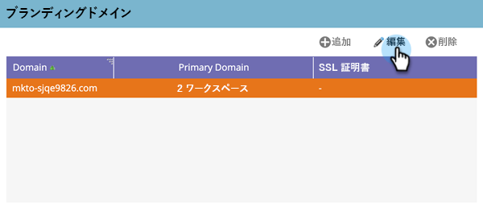
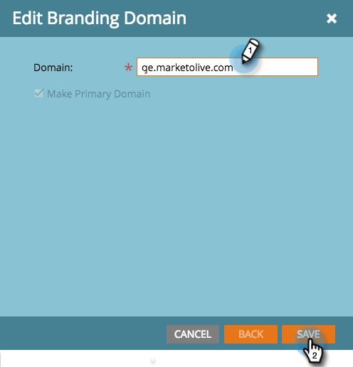

# デフォルトのブランディングドメインの編集 {#edit-your-default-branding-domain}

デフォルトのブランディングドメインの編集は、ブランディングドメインを操作する際の最初の手順です。

>[!PREREQUISITES]
>
>Marketo にブランディングドメインを追加する前に、[DNS で CNAME を設定](/help/marketo/getting-started/initial-setup/configure-protocols-for-marketo.md){target="_blank"}しておくようにします。

1. 「**[!UICONTROL 管理者]**」領域に移動します。

   

1. 「**[!UICONTROL メール]**」をクリックします。

   

1. [!UICONTROL ブランディングドメイン]テーブルで、汎用ドメインを選択し、「編集」をクリックして、自社のブランディングドメインに変更します。

   

   >[!NOTE]
   >
   >最初に汎用ドメインを編集するまで、ドメインは追加できません。

1. デフォルトのドメイン名を入力し、「**[!UICONTROL 保存]**」をクリックします。

   

これで、必要な[追加のブランディングドメインを追加](/help/marketo/product-docs/administration/email-setup/add-multiple-branding-domains/add-an-additional-branding-domain.md){target="_blank"}できるようになりました。

>[!NOTE]
>
>既存の SSL を更新または削除する必要がある場合は、[Marketo サポート](https://nation.marketo.com/t5/support/ct-p/Support){target="_blank"}にお問い合わせください。
