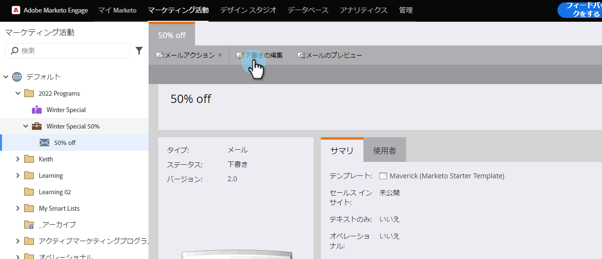
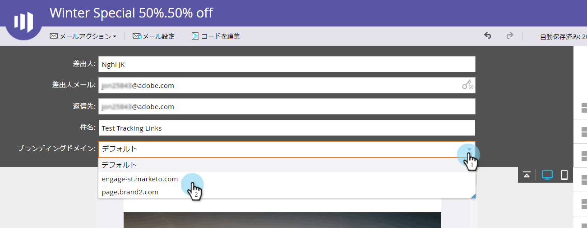

# 電子メールのプライマリドメインを上書き{#overwrite-primary-domain-for-emails}

プライマリブランドドメインは、電子メール単位で上書きできます。 これにより、電子メール送信時にリンクのブランディング方法が変更されます。

1. **マーケティングアクティビティ**&#x200B;に移動します。

   

1. 電子メールを選択し、「**ドラフトを編集**」をクリックします。

   

1. 使用するブランディングドメインを選択します。

   

   >[!NOTE]
   >
   >すべてのユーザーが、ブランドドメインを電子メール単位で設定する権限を持っているわけではありません。 ブランドドメインドロップダウンが表示されない場合は、管理者に問い合わせてください。

