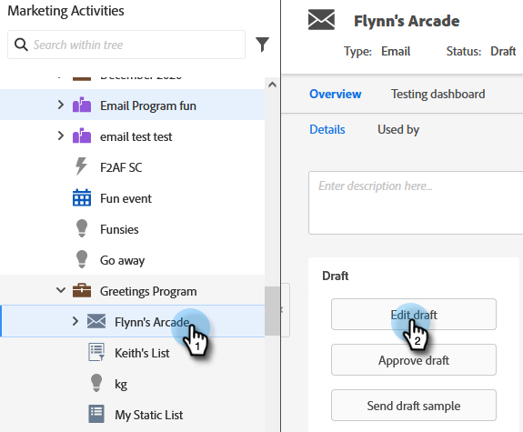

# メールのプライマリドメインを上書きする {#overwrite-primary-domain-for-emails}

プライマリブランドドメインは、メールごとに上書きできます。これにより、メールの送信時にリンクのブランドを設定する方法が変更されます。

1. 「**[!UICONTROL マーケティングアクティビティ]**」に移動します。

   

1. メールを選択して、「**[!UICONTROL ドラフトの編集]**」をクリックします。

   

1. 使用するブランディングドメインを選択します。

   

   >[!NOTE]
   >
   >すべてのユーザーに、メールごとにブランドドメインを設定する権限があるわけではありません。が [!UICONTROL ブランディングドメイン] 」ドロップダウンリストから選択できます。
