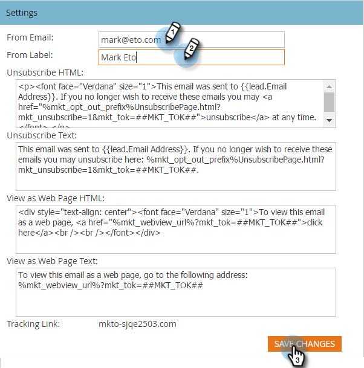

# デフォルトのメール差出人と差出人ラベルの変更 {#change-the-default-from-email-and-from-label}

各管理者ユーザーは、**[!UICONTROL 電子メールから]**&#x200B;および&#x200B;**[!UICONTROL ラベルから]**&#x200B;のデフォルト値を変更して、新しい電子メールを作成する際に、これらのデフォルト値を使用できるようにすることができます。

>[!NOTE]
>
>**管理者権限が必要**

1. 「**[!UICONTROL 管理者]**」セクションに移動します。

   

1. 「**[!UICONTROL メール]**」をクリックします。

   

1. **[!UICONTROL 電子メールから]**&#x200B;および&#x200B;**[!UICONTROL ラベルから]**&#x200B;のデフォルト値を入力し、**[!UICONTROL 変更を保存]**&#x200B;をクリックします。

   

>[!NOTE]
>
>この変更が適用されるのは自分のみで、他の Marketo ユーザには適用されません。

新しい電子メールを作成するたびに、設定したデフォルト値が使用されます。
