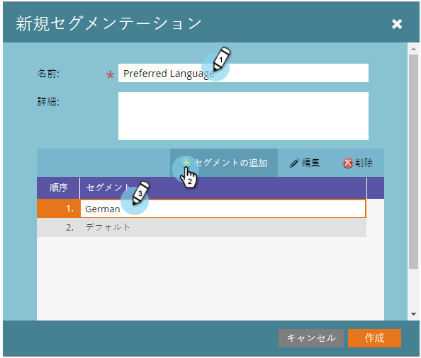
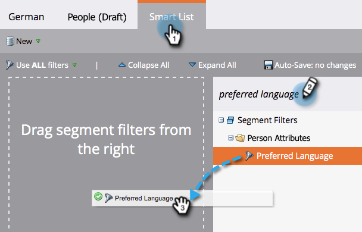
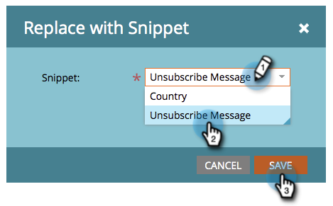
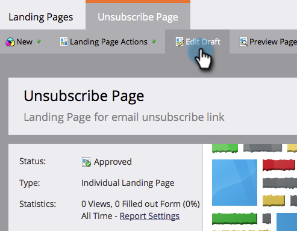

# 登録解除メッセージを言語に対して動的にする {#make-your-unsubscribe-message-dynamic-for-languages}

デフォルトの登録解除メッセージおよびリンクは英語です。 動的なコンテンツを使用して、異なる言語で表示できます。

>[!NOTE]
>
>以下に、この小さなチュートリアルを設定しました。 これはベストプラクティスですが、他の方法でも実行できます。

1. データの準備
1. [「Preferred Language」という名前のカスタム](../../../../product-docs/administration/field-management/create-a-custom-field-in-marketo.md)フィールドを作成します。 （このフィールドを同期する場合は、CRMで設定します）。

   >[!TIP]
   >
   >今後、言語設定を取り込むためのフォームを [作成する際に](../../../../product-docs/demand-generation/forms/creating-a-form/create-a-form.md) 、このフィールドを使用します。

1. セグメントの作成
1. データ **ベースに移動します**。** 

   **

1. 「 **新規** 」ドロップダウンで、「 **新しいセグメント**」をクリックします。

   

1. セグメントに **Preferred Language**（優先言語）という名前を付けます。 「 **追加セグメント**」をクリックします。 言語を入力します。

   

   >[!NOTE]
   >
   >デフォルトのセグメントは英語です。

1. すべての言語が表示されるまで、セグメントの追加を続けます。 「 **作成**」をクリックします。

   

1. セグメントを選択します。

   

1. 「 **スマートリスト** 」タブに移動します。 検索フィールドに **「優先言語** 」を入力します。 フィルターをキャンバスにドラッグ&amp;ドロップします。

   

1. 対応する言語を設定します。

   

1. 各言語に対して同じ手順を繰り返します。 次に、 **セグメントアクション** ドロップダウンを選択し、「 **承認**」をクリックします。

   

1. スニペットの作成
1. Design **Studioに移動します**。

   

1. 「 **新規** 」ドロップダウンで、「 **新規スニペット**」をクリックします。

   ** 

   **

1. スニペットに「 **Unsubscribe Message**」という名前を付けます。 「 **作成**」をクリックします。

   

1. デフォルトの登録解除メッセージを入力し、ハイライト表示して、ハイパーリンクアイコンをクリックします。

   

1. 次のトークンをコピー&amp;ペーストします。 **`{{system.unsubscribeLink}}`** を「 **リンクURL** 」フィールドに入力します。 [ **挿入**]をクリックします。

   

1. 「セグメ **ント化」セクションで** 「セグメント化基準」を選択します。

   

1. セグメントドロップダウンから、「 **優先** 」に入力し、「 **優先言語**」を選択します。 「 **保存**」をクリックします。

   

1. ツリーからセグメントを選択します。 登録解除メッセージをその言語で入力します。

   

1. 同じトークンをコピーして貼り付けます。 **`{{system.unsubscribeLink}}`** を「 **リンクURL** 」フィールドに入力します。 [ **挿入**]をクリックします。

   

1. すべてのセグメントに対して同じ手順を繰り返します。 次に、Design Studioに戻り、「 **スニペットのアクション** 」ドロップダウンをクリックし、「 **承認**」をクリックします。

   

   すごい。 もう少しで。

1. 電子メールでのスニペットの使用
1. 電子メールエディター内で、編集可能な要素をクリックします。 次に、歯車アイコンをクリックし、「スニペットと **置換**」を選択します。 編集可能なスニペット要素を選択する場合は、歯車アイコンをクリックし、「 **編集**」を選択します。

   

1. ドロップダウンからスニペットを探して選択し、「 **保存**」をクリックします。

   

1. テストアウトするには、[ **戻る**...]をクリックします。

   

1. ...「 **動的** 」タブをクリックします。

   

1. 別の言語をクリックして、スニペットの変更を表示します。

   

   >[!TIP]
   >
   >もちろん、残りの電子メールは動的な言語用に編集することもできます。 この操作を行っている間は、登録解除ページでも同じ方法を実行します。

1. 動的コンテンツを含む登録解除ページのカスタマイズ

   ユーザーが好みの言語で登録解除ページにアクセスするようにする場合は、ランディングページーと確認ページで動的コンテンツを使用できます。

   Design Studioに移動します。

   

   検索フィールドに「登録解除」と入力します。 登録解除ページが見つかるはずです。

   

   「ドラフトを編集」をクリックします。

   

   「セグメントの基準」を選択します。

   

   「優先言語」セグメントを探します。 「保存」をクリックします。

   

   各ランディングページのコンテンツを編集し、承認すると、問題なく操作できます。

   >[!NOTE]
   >
   >**ディープダイブ**
   >
   >
   >動的なコンテンツ [とすべての素晴らしい機能について詳しく説明します](../../../../product-docs/personalization/segmentation-and-snippets/segmentation/understanding-dynamic-content.md) 。

