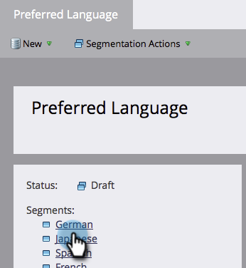
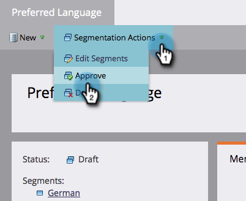
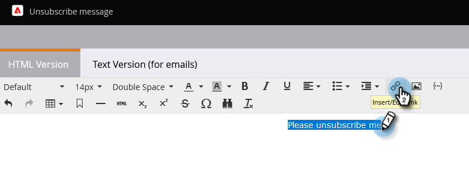
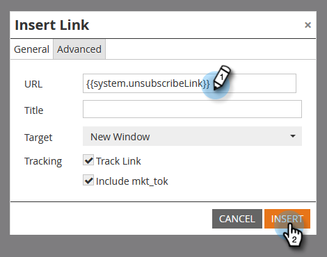
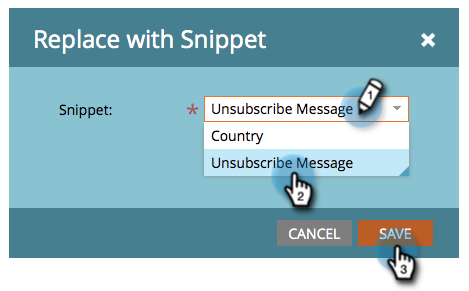
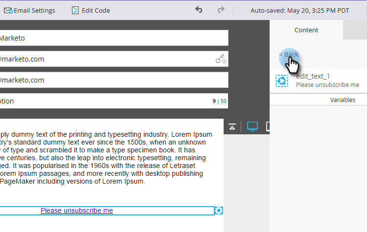
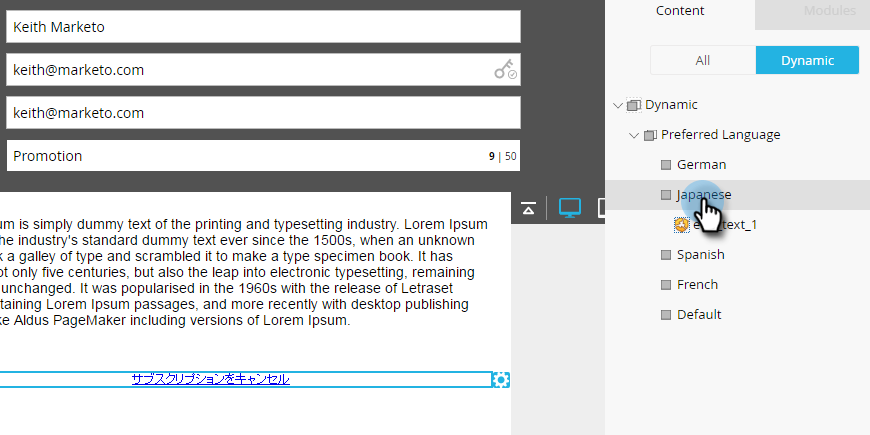
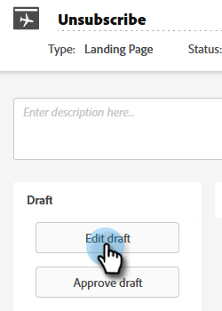
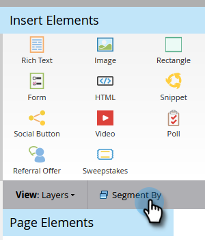

# 登録解除メッセージを言語に対して動的に設定 {#make-your-unsubscribe-message-dynamic-for-languages}

デフォルトの登録解除メッセージとリンクは英語です。 動的コンテンツを使用して、様々な言語で表示できます。

>[!NOTE]
>
>この記事はベストプラクティスですが、他の方法でも達成できます。

## データを準備する {#prepare-your-data}

1. 「優先言語」という名前の[カスタムフィールドを作成](/help/marketo/product-docs/administration/field-management/create-a-custom-field-in-marketo.md)します。 （このフィールドを同期する場合は、CRM で設定します）

   >[!TIP]
   >
   >今後、言語の環境設定を取得するために[フォームを作成](/help/marketo/product-docs/demand-generation/forms/creating-a-form/create-a-form.md)するときに、このフィールドを使用します。

## セグメントを作成する {#create-segmentation}

1. **[!UICONTROL データベース]**&#x200B;に移動します。

   

1. **[!UICONTROL 新規]**&#x200B;ドロップダウンで、**[!UICONTROL 新規セグメンテーション]**&#x200B;をクリックします。

   

1. セグメントに「**[!UICONTROL 優先言語]**」という名前を付けます。 「**[!UICONTROL セグメントを追加]**」をクリックします。 言語を入力します。

   

   >[!NOTE]
   >
   >デフォルトのセグメントは英語になります。

1. すべての言語が表示されるまで、セグメントの追加を続けます。 「**[!UICONTROL 作成]**」をクリックします。

   

1. セグメントを選択します。

   

1. 「**[!UICONTROL スマートリスト]**」タブに移動します。 検索フィールドに&#x200B;**[!UICONTROL 優先言語]**&#x200B;を入力します。 フィルターをキャンバスにドラッグ＆ドロップします。

   

1. 適切な対応言語を設定します。

   

1. すべての言語で繰り返します。 次に、**[!UICONTROL セグメンテーションアクション]**&#x200B;ドロップダウンを選択して、**[!UICONTROL 承認]**&#x200B;をクリックします。

   

## スニペットの作成 {#create-a-snippet}

1. **[!UICONTROL Design Studio]** に移動します。

   

1. **[!UICONTROL 新規]** ドロップダウンで、**[!UICONTROL 新規スニペット]**&#x200B;をクリックします。

   

1. スニペットに「**登録解除メッセージ**」という名前を付けます。 「**[!UICONTROL 作成]**」をクリックします。

   

1. デフォルトの登録解除メッセージを入力し、ハイライト表示して、ハイパーリンクアイコンをクリックします。

   

1. トークン `{{system.unsubscribeLink}}` を「**[!UICONTROL URL]**」フィールドにコピー＆ペーストします。 「**[!UICONTROL 挿入]**」をクリックします。

   

1. 「**[!UICONTROL セグメンテーション]**」セクションの「**[!UICONTROL セグメンテーション基準]**」を選択します。

   

1. **[!UICONTROL セグメンテーション]**&#x200B;ドロップダウンで、**[!UICONTROL 優先]**&#x200B;と入力し、「**[!UICONTROL 優先言語]**」を選択します。 「**[!UICONTROL 保存]**」をクリックします。

   

1. ツリーからセグメントを選択します。 登録解除テキストをクリックし、リンクアイコンをクリックします。

   

1. `{{system.unsubscribeLink}}` がまだ「**[!UICONTROL URL]**」フィールドにあることを確認します。 「**[!UICONTROL 表示テキスト]**」を編集して、選択した言語に一致するようにします。 「**[!UICONTROL 適用]**」をクリックします。

   

1. すべてのセグメントに対してこの手順を繰り返します。 次に、**[!UICONTROL Design Studio]** に戻り、**[!UICONTROL スニペットアクション]**&#x200B;ドロップダウンをクリックして、**[!UICONTROL 承認]**&#x200B;をクリックします。

   

## メールでのスニペットの使用 {#use-a-snippet-in-an-email}

1. メールエディターで、編集可能な要素をクリックします。 次に、歯車アイコンをクリックし、「**[!UICONTROL スニペットに置換]**」を選択します。 編集可能なスニペット要素を選択した場合は、歯車アイコンをクリックし、**[!UICONTROL 編集]**&#x200B;を選択します。

   

1. ドロップダウンからスニペットを探して選択し、「**[!UICONTROL 保存]**」をクリックします。

   

1. テストするには、**[!UICONTROL 戻る]**&#x200B;をクリックしてください…

   

1. ...次に「**[!UICONTROL 動的]**」タブをクリックします。

   

1. 異なる言語をクリックして、スニペットの変更を確認します。

   

   >[!TIP]
   >
   >また、動的な言語設定のために残りのメールを編集することもできます。 登録解除ページでも同じ方法を使用できます。

## 動的コンテンツで購読解除ページをカスタマイズ {#customize-your-unsubscribe-page-with-dynamic-content}

登録解除ページが優先言語で表示されるようにする場合は、ランディングページと確認ページで動的コンテンツを使用できます。

1. **[!UICONTROL Design Studio]** に移動します。

   

1. 検索フィールドに&#x200B;_登録解除_&#x200B;と入力して、目的の登録解除ページを選択します。

   

1. **[!UICONTROL ドラフトの編集]**&#x200B;をクリックします。

   

1. 「**[!UICONTROL セグメント別]**」を選択します。

   

1. 「**[!UICONTROL 優先言語]**」セグメントを見つけます。 「**[!UICONTROL 保存]**」をクリックします。

   

   >[!NOTE]
   >
   >[動的コンテンツ &#x200B;](/help/marketo/product-docs/personalization/segmentation-and-snippets/segmentation/understanding-dynamic-content.md)の詳細をご覧ください。
