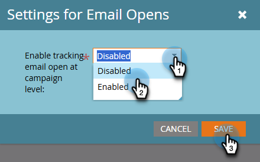

# キャンペーンレベルでのメールの開封トラッキング {#email-open-tracking-at-campaign-level}

この機能を使用すると、キャンペーンでの開封ごとに 1 回、または様々なキャンペーンでの使用回数に関係なく、各メールに対して 1 回だけ、トラッキングメールの開封数を制御できます。

>[!NOTE]
>
>**管理者権限が必要**

1. 「**管理者**」領域に移動します。

   

1. 「**スマートキャンペーン**」をクリックします。

   

1. _メール開封数の設定_ の横の「**編集**」をクリックします。

   

1. ドロップダウンをクリックし、目的の設定を選択して「**保存**」をクリックします。

   

<table><tbody>
  <tr>
    <td><b>有効</b></td>
    <td>メールの開封は、キャンペーンごとに個別にトラッキングされます。</td>
  </tr>
  <tr>
    <td><b>無効</b></td>
    <td>メールの開封はトラッキングされます。</td>
  </tr>
</tbody>
</table>
