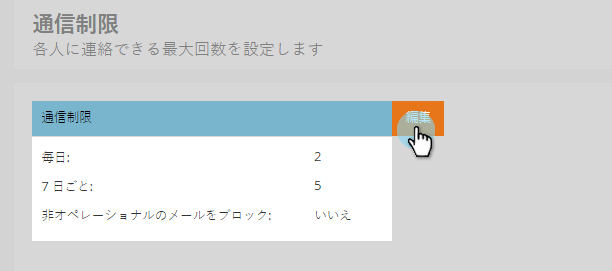
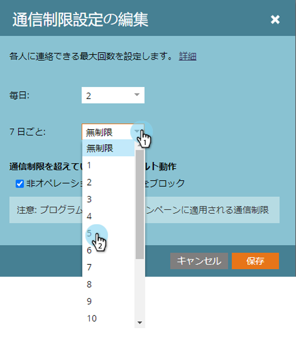
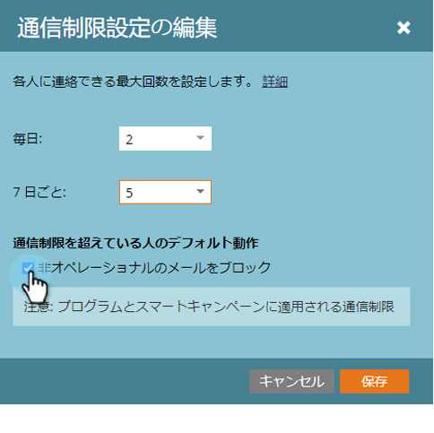
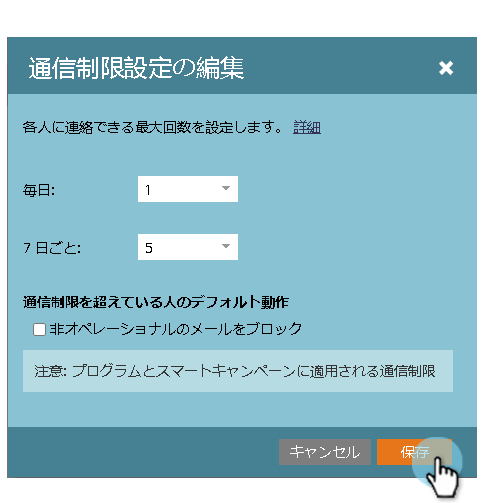

# 通信制限を有効にする {#enable-communication-limits}

人と過度にコミュニケーションを取らないことは非常に重要です。 通信の制限を設定すると、組織が送信する電子メールの数が多くなるのを防ぐのに役立ちます。

>[!NOTE]
>
>**必要な管理者権限**

1. 「 **管理者**」で、「 **通信制限」をクリックします**。

   
「編集」をクリックします。
   

   >[!NOTE]
   >
   >
   >日ごとは、購読のタイムゾーン（午前0時～午前0時）のカレンダー日に基づきます。

1. 「 **日ごと** 」ドロップダウンをクリックし、必要な制限を選択します。 この例では、「1」を選択します。

   

   >[!TIP]
   >
   >プリセットのオプションが機能しない場合は、「 **カスタム** 」を選択することもできます。

1. 「7日 **ごと** 」ドロップダウンをクリックし、必要な制限を選択します。 この例では、「5」を選択します。

   

1. 「 **操作不能な電子メールをブロック**」を選択します。

   

   >[!NOTE]
   >
   >操作用電子メールの [詳細](http://docs.marketo.com/display/DOCS/Make+an+Email+Operational) 。

1. 「 **保存**」をクリックします。

   

   >[!NOTE]
   >
   >**例**
   >
   >
   >上記の設定は、1日に **1通以上の電子メールを受信しない** 、または7日間に **5を超える電子メールを受信しないことを意味します**。

   >[!NOTE]
   >
   >
   >通信の制限は、すべての電子メールとエンゲージメントのプログラムに自動的に適用されます。

>[!MORELIKETHIS]
>
>[スマートキャンペーンへの通信制限の適用](../../../product-docs/core-marketo-concepts/smart-campaigns/using-smart-campaigns/apply-communication-limits-to-smart-campaign.md)

