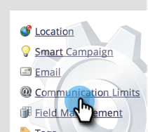
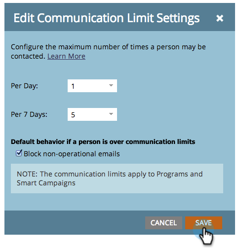

# 通信制限の有効化 {#enable-communication-limits}

過度にコミュニケーションを取らないことは非常に重要です。通信制限を設定すると、組織が多数のメールを送信するのを防ぐのに役立ちます。

>[!NOTE]
>
>**管理者権限が必要**

1. 「**[!UICONTROL 管理者]**」領域に移動します。

   

1. 「**[!UICONTROL 通信制限]**」をクリックします。

   

1. 「**[!UICONTROL 編集]**」をクリックします。

   

   >[!NOTE]
   >
   >[!UICONTROL 「日別」は、サブスクリプションタイムゾーンのカレンダー日（午前 0 時～午前 0 時）に基づきます。]

1. 「**[!UICONTROL 日別]**」ドロップダウンリストをクリックし、目的の制限を選択します。この例では、「1」を選択します。

   

   >[!TIP]
   >
   >また、どのプリセットオプションも適切ではない場合、「**[!UICONTROL カスタム]**」を選択します。

1. 「**[!UICONTROL 7 日別]**」ドロップダウンリストをクリックし、目的の制限を選択します。この例では、「5」を選択します。

   

1. 「**[!UICONTROL 非オペレーショナルメールをブロックする]**」を選択します。

   

   >[!NOTE]
   >
   >詳しくは、[オペレーショナルメール](/help/marketo/product-docs/email-marketing/general/functions-in-the-editor/make-an-email-operational.md)を参照してください。

1. 「**[!UICONTROL 保存]**」をクリックします。

   

   >[!NOTE]
   >
   >**例**
   >
   >上記の設定により、ユーザーは、**1 日に 1 件のメール**&#x200B;または&#x200B;**任意の 7 日間で 5 回**&#x200B;以上受け取らなくなります。

   >[!NOTE]
   >
   >すべてのメールおよびエンゲージメントプログラムに、通信制限が自動的に適用されます。

>[!MORELIKETHIS]
>
>[スマートキャンペーンへの通信制限の適用](/help/marketo/product-docs/core-marketo-concepts/smart-campaigns/using-smart-campaigns/apply-communication-limits-to-smart-campaign.md)
