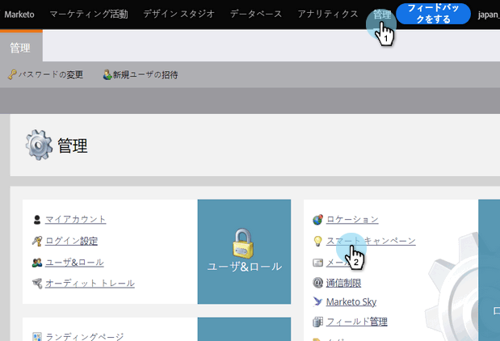
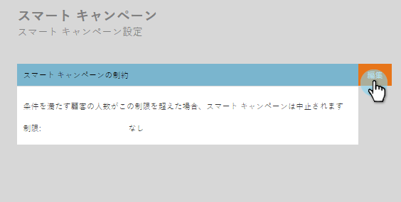
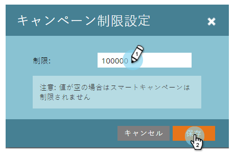

# スマートキャンペーンに対する個人制限の有効化 {#enable-person-restrictions-for-smart-campaigns}

Marketoには、スマートキャンペーンに振り分けることのできる人数を***最大***数に制限する機能があります。 これにより、誤ってデータベース全体を電子メールで送信するのを防ぎます。

>[!NOTE]
>
>**必要な管理者権限**

>[!CAUTION]
>
>これは、バッチキャンペーンと電子メールプログラムにのみ適用されます。

1. 「**管理者**」をクリックし、「 **スマートキャンペーン**」をクリックします。

   

   「編集」をクリックします。

   

   >[!CAUTION]
   >
   >
   >スマートキャンペーンを実行する資格のある人の数が、設定された制限を超えると、まったく実行されません。

   制限を入力し、「保存」をクリックします。

   

   >[!TIP]
   >
   >
   >このフィールドを空白にして、この機能を無効にします。

   >[!CAUTION]
   >
   >
   >この制限は、すべてのスマートキャンペーンに適用されますが、キャンペーンレベルで上書きできます。 スマートキャンペーンで個人の制限を [上書きする方法を説明します](../../../product-docs/core-marketo-concepts/smart-campaigns/using-smart-campaigns/override-person-restrictions-in-a-smart-campaign.md)。

ビンゴ！ セーフティスイッチを入れただけ。 良い考えだろ？

>[!MORELIKETHIS]
>
>* [スマートキャンペーンの個人制限の上書き](../../../product-docs/core-marketo-concepts/smart-campaigns/using-smart-campaigns/override-person-restrictions-in-a-smart-campaign.md)

>

