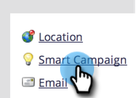

# スマートキャンペーンの対象者制限の有効化 {#enable-person-restrictions-for-smart-campaigns}

Marketoには、スマートキャンペーンの対象となるユーザーの数を&#x200B;_最大_&#x200B;人に制限する機能があります。 これにより、データベース全体に誤ってメールが送信されるのを防ぎます。

>[!NOTE]
>
>**管理者権限が必要**

>[!CAUTION]
>
>これは、バッチキャンペーンとメールプログラムにのみ適用されます。

1. 「**[!UICONTROL 管理者]**」領域に移動します。

   

1. 「**[!UICONTROL スマートキャンペーン]**」をクリックします。

   

1. 「**[!UICONTROL 編集]**」をクリックします。

   

   >[!CAUTION]
   >
   >スマートキャンペーンを実行する資格を持つユーザーの数が制限セットを超えた場合、まったく実行されません。

1. 制限を入力し、「**[!UICONTROL 保存]**」をクリックします。

   

   >[!TIP]
   >
   >この機能を無効にするには、フィールドを空白にします。

   >[!CAUTION]
   >
   >この制限はすべてのスマートキャンペーンに適用されますが、キャンペーンレベルで上書きできます。 [スマートキャンペーンでの人物制限の上書き](/help/marketo/product-docs/core-marketo-concepts/smart-campaigns/using-smart-campaigns/override-person-restrictions-in-a-smart-campaign.md)方法を参照してください。

>[!MORELIKETHIS]
>
>[スマートキャンペーンでの人物制限の上書き](/help/marketo/product-docs/core-marketo-concepts/smart-campaigns/using-smart-campaigns/override-person-restrictions-in-a-smart-campaign.md)
