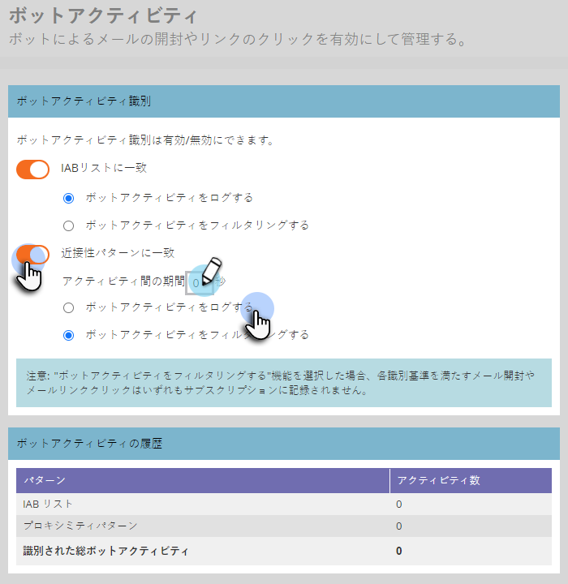

# メールボットアクティビティのフィルター {#filtering-email-bot-activity}

メールボットアクティビティによって、メールの開封数とクリック数のデータが誤って水増しされる場合があります。以下の手順に従って修正します。

以下の 2 つの異なる方法を使用して、ボットアクティビティを確認します。

* [&#x200B; インタラクティブAdvertisingビューローボットリスト &#x200B;](https://www.iab.com/guidelines/iab-abc-international-spiders-bots-list/){target="_blank"} との一致：IAB UA/IP （ユーザーエージェント/IP アドレス）リストのすべての項目と一致するアクティビティは、ボットとしてマークされます。
* 近接性パターンと一致：同時に 2 つ以上のアクティビティが発生した場合（1 秒未満）、それらはボットとして識別されます。比較時に考慮される属性は以下のとおりです。
   * リード ID（同じであること）
   * メールアセット（同じであること）
   * リンククリックまたはメール開封
   * 時間差（1 秒未満であること）

メールリンクのクリックとメールの開封アクティビティに対して、新しい属性は以下の値で設定されます。

* ボットとして識別されたアクティビティは、「ボットアクティビティ」が「True」、「ボットアクティビティパターン」が識別されたパターン／メソッドとして設定されます。
* ボットでないと識別されたアクティビティは、「ボットアクティビティ」が「False」に、「ボットアクティビティパターン」が「N/A」に設定されます。
* これらの属性を導入する前に発生したアクティビティは、「ボットアクティビティ」が「（空）」、「ボットアクティビティパターン」が「（空）」になります。

## フィルタータイプの選択 {#select-filter-type}

1. 「**[!UICONTROL 管理者]**」をクリックします。

   

1. 「**[!UICONTROL メール]**」をクリックします。

   

1. 「**[!UICONTROL ボットアクティビティ]**」タブをクリックします。

   

1. 選択できるスライダーは 2 つあります。1 つだけを有効にすることも、両方を有効にすることもできます。「**[!UICONTROL IAB リストと一致]**」を有効にした場合は、[!UICONTROL ボットアクティビティをログに記録]する&#x200B;_か、_[!UICONTROL ボットアクティビティをフィルタリング]するかを選択します。

   

1. 「**[!UICONTROL 近接性パターンと一致]**」を有効にした場合は、[!UICONTROL ボットアクティビティをログに記録]する&#x200B;_か、_[!UICONTROL ボットアクティビティをフィルタリング]するかを選択します。「**アクティビティ間の期間**」の秒数を設定することもできます（デフォルトは 0、最大値は 3）。

   

>[!NOTE]
>
>「**アクティビティ間の期間**」を 0 秒に設定すると、まったく同じ秒に発生しているメールアクティビティが識別されます。指定した秒数以内に複数のメールアクティビティが発生した場合は、ボットアクティビティとして識別されます。

>[!IMPORTANT]
>
>* 「[!UICONTROL ボットアクティビティをフィルタリング]」を選択した場合、誤ったアクティビティが除外されるので、メールの開封数とクリック数が減少する可能性があります。

**オプションの手順**：いずれかの機能を無効にするには、単に選択スライダーの選択を解除します。その場合も、データはリセットされません。

>[!TIP]
>
>「メール内のリンクをクリック」および「メールを開く」フィルターと「メール内のリンクをクリック」および「メールを開く」トリガーで、「ボットアクティビティ」ブール値（はい／いいえ）と「ボットアクティビティパターン」を使用して、スマートリストのボットアクティビティデータを活用します。

## IP のブロックリスト {#ip-blocklist}

以下のいずれかの IP から受信したエンゲージメントは自動的に除外され、Marketo Engage インスタンスに追加されないので、数百万もの偽のエンゲージメントを生成する原因となっている IP アドレスのリストを作成しました。その結果、メールの開封数、クリック数、その他の関連アクティビティが減少する可能性があります。以下のリストは定期的に更新される場合があります。

* 40.94.34.52
* 40.94.34.86
* 52.34.76.65
* 54.70.53.60
* 54.71.187.124
* 60.28.2.248
* 64.235.150.252
* 64.235.153.10
* 64.235.153.2
* 64.235.154.105
* 64.235.154.109
* 64.235.154.140
* 64.74.215.1
* 64.74.215.100
* 64.74.215.138
* 64.74.215.139
* 64.74.215.142
* 64.74.215.146
* 64.74.215.150
* 64.74.215.154
* 64.74.215.158
* 64.74.215.162
* 64.74.215.164
* 64.74.215.166
* 64.74.215.170
* 64.74.215.174
* 64.74.215.176
* 64.74.215.178
* 64.74.215.51
* 64.74.215.56
* 64.74.215.58
* 64.74.215.59
* 64.74.215.86
* 64.74.215.98
* 65.154.226.101
* 66.249.91.149
* 70.42.131.106
* 74.125.217.116
* 74.217.90.250
* 104.129.41.4
* 104.47.55.126
* 104.47.58.126
* 104.47.70.126
* 104.47.73.126
* 104.47.73.254
* 104.47.74.126
* 128.220.160.1
* 155.70.39.101
* 162.129.251.14
* 162.129.251.42
* 208.52.157.204

>[!NOTE]
>
>このリストに追加する前に、すべての IP アドレスを細心の注意を払って分析および調査し、最も重大で有害な IP のみがブロックされるようにします。
