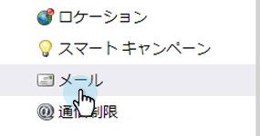
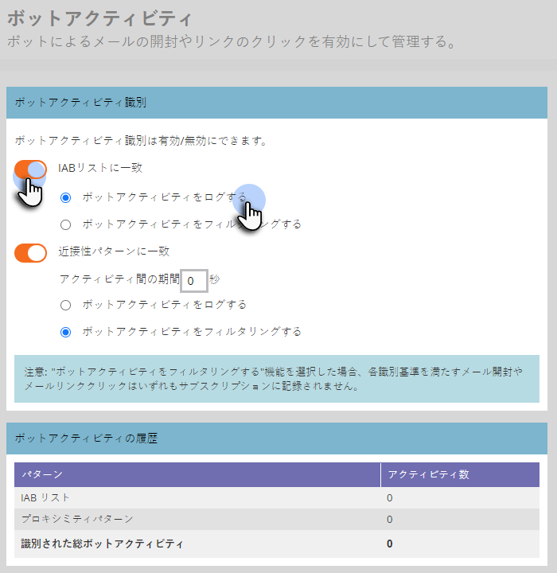

# メールボットアクティビティのフィルター {#filtering-email-bot-activity}

メールボットアクティビティによって、メールの開封数とクリック数のデータが誤って水増しされる場合があります。これは次のように修正できます。

>[!NOTE]
>
>[IAB/ABC International Spiders and Bots List](https://www.iab.com/guidelines/iab-abc-international-spiders-bots-list/) を使用すると、このリストに記載されている IP またはユーザーエージェントを含むすべての開封／クリックアクティビティは、ボットアクティビティとして識別され、Marketo にはログインされません。

1. 「**管理**」をクリックします。

   

1. 「**メール**」をクリックします。

   

1. 「**ボットアクティビティ**」タブをクリックします。

   

1. 「**メールボットアクティビティのフィルターを有効にする**」チェックボックスをオンにします。

   

>[!NOTE]
>
>この機能を有効にすると、不正な数は除外されるので、メールの開封数とクリック数が減少する場合があります。

**オプションの手順**：チェックボックスをオフにすればこの機能は無効になります。無効にした場合、「過去 90 日間のボットアクティビティ」データはリセット&#x200B;**されません**。
