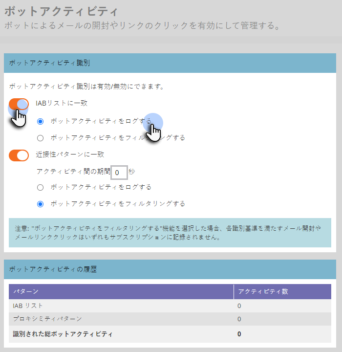
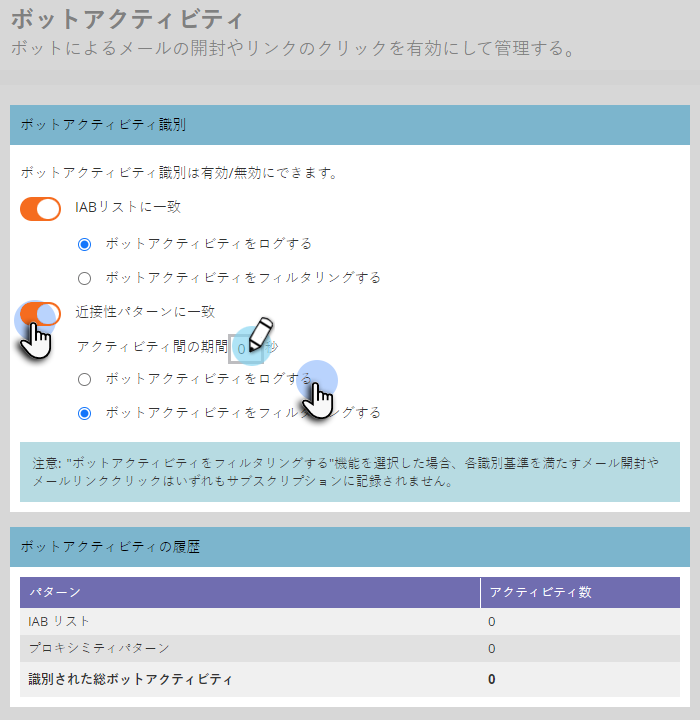

# メールボットアクティビティのフィルター {#filtering-email-bot-activity}

メールボットアクティビティによって、メールの開封数とクリック数のデータが誤って水増しされる場合があります。 これに対処するには、次の手順に従います。

ボットのアクティビティを確認するには、次の2つの個別の方法を使用します。

* [Interactive Advertising Bureau Bot list](https://www.iab.com/guidelines/iab-abc-international-spiders-bots-list/){target="_blank"}と一致：IAB UA/IP （User Agent/IP アドレス）リスト上の任意の項目と一致するアクティビティは、ボットとしてマークされます。
* 近接性パターンと一致：同時に 2 つ以上のアクティビティが発生した場合（1 秒未満）、それらはボットとして識別されます。 比較時に考慮される属性は以下のとおりです。
   * リード ID（同じであること）
   * メールアセット（同じであること）
   * リンククリックまたはメール開封
   * 時間差（1 秒未満であること）

メールリンクのクリックとメールの開封アクティビティに対して、新しい属性は以下の値で設定されます。

* ボットとして識別されたアクティビティは、「ボットアクティビティ」が「True」、「ボットアクティビティパターン」が識別されたパターン／メソッドとして設定されます。
* ボットでないと識別されたアクティビティは、「ボットアクティビティ」が「False」に、「ボットアクティビティパターン」が「N/A」に設定されます。
* これらの属性が導入される前に発生したアクティビティは、「」として「ボットアクティビティ」を持ち、「」として「ボットアクティビティパターン」を持ちます

## フィルタータイプの選択 {#select-filter-type}

1. 「**[!UICONTROL 管理者]**」をクリックします。

   

1. 「**[!UICONTROL メール]**」をクリックします。

   

1. 「**[!UICONTROL ボットアクティビティ]**」タブをクリックします。

   

1. 選択できるスライダーは 2 つあります。 1 つだけを有効にすることも、両方を有効にすることもできます。 「**[!UICONTROL IAB リストと一致]**」を有効にした場合は、[!UICONTROL ボットアクティビティをログに記録]する&#x200B;_か、_[!UICONTROL ボットアクティビティをフィルタリング]するかを選択します。

   

1. 「**[!UICONTROL 近接性パターンと一致]**」を有効にした場合は、[!UICONTROL ボットアクティビティをログに記録]する&#x200B;_か、_[!UICONTROL ボットアクティビティをフィルタリング]するかを選択します。 **アクティビティ間の期間**&#x200B;の秒数も設定できます（デフォルトは0、最大は3）。

   

>[!NOTE]
>
>**アクティビティ間の期間**&#x200B;を0秒に設定すると、メールアクティビティがまったく同じ秒に発生していることが識別されます。 指定された秒数の間に複数のメールアクティビティが発生した場合、それらのアクティビティはボットアクティビティとして識別されます。

>[!IMPORTANT]
>
>* 「[!UICONTROL &#x200B; ボットアクティビティをフィルター]」を選択すると、誤ったアクティビティが削除されると、メールの開封数とクリック数が低下する場合があります。

**オプション手順**：いずれかの機能を無効にするには、それぞれのスライダーの選択を解除します。 その場合も、データはリセットされません。

>[!TIP]
>
>スマートリストでボットアクティビティデータを使用するには、「電子メールのクリックリンク」および「電子メールを開く」フィルターの「ボットアクティビティパターン」および「ボットアクティビティパターン」を使用し、「電子メールのクリックリンク」および「電子メールを開く」トリガーを使用します。

## IP のブロックリスト {#ip-blocklist}

Marketoは、何百万もの偽のエンゲージメントを生み出す責任を負うIP アドレスのリストを作成しました。 その結果、次のIPから受信したエンゲージメントは自動的に除外され、Marketo Engage サブスクリプションには追加されません。 その結果、メールの開封数、クリック数、その他の関連アクティビティが減少する可能性があります。 以下のリストは定期的に更新される場合があります。

* 40.94.34.52
* 40.94.34.86
* 52.34.76.65
* 54.70.53.60
* 54.71.187.124
* 60.28.2.248
* 64.235.150.252
* 64.235.153.10
* 64.235.153.2
* 64.235.154.105
* 64.235.154.109
* 64.235.154.140
* 64.74.215.1
* 64.74.215.100
* 64.74.215.138
* 64.74.215.139
* 64.74.215.142
* 64.74.215.146
* 64.74.215.150
* 64.74.215.154
* 64.74.215.158
* 64.74.215.162
* 64.74.215.164
* 64.74.215.166
* 64.74.215.170
* 64.74.215.174
* 64.74.215.176
* 64.74.215.178
* 64.74.215.51
* 64.74.215.56
* 64.74.215.58
* 64.74.215.59
* 64.74.215.86
* 64.74.215.98
* 65.154.226.101
* 66.249.91.149
* 70.42.131.106
* 74.125.217.116
* 74.217.90.250
* 104.129.41.4
* 104.47.55.126
* 104.47.58.126
* 104.47.70.126
* 104.47.73.126
* 104.47.73.254
* 104.47.74.126
* 128.220.160.1
* 155.70.39.101
* 162.129.251.14
* 162.129.251.42
* 208.52.157.204

>[!NOTE]
>
>すべてのIP アドレスは、このリストに追加される前に慎重に確認され、最も有害なIPのみがブロックされるようにします。
