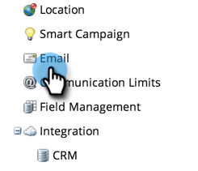

# 登録解除テキストの削除 {#remove-unsubscribe-text}

購読解除コンテンツを&#x200B;**[!UICONTROL 管理者]** > **[!UICONTROL 電子メール]**&#x200B;領域から完全に削除する必要がある唯一の理由は、購読解除リンクを電子メールテンプレート自体に構築することを選択している場合です。 テキストボックスには、コンテンツなしで保存できない検証機能があります。 この問題を回避するには、小さな HTML コメントを追加します。 HTML コメントは、メールクライアントに表示されません。メールが HTML でレンダリングされ、コメントは省略されるからです。

1. 「**[!UICONTROL 管理者]**」領域に移動します。

   

1. 「**[!UICONTROL メール]**」をクリックします。

   

1. すべてのテキストを選択し、「**[!UICONTROL 削除]**」キーを押します。

   >[!CAUTION]
   >
   >削除する前に、バックアップとしてこれをテキストドキュメントにコピー＆ペーストします。

1. `<!--This is a comment -->` と入力します。

   

1. 「**[!UICONTROL 変更を保存]**」をクリックします。

   

>[!NOTE]
>
>**登録解除テキスト**&#x200B;向けに 1 文字追加する必要があります。 ダッシュまたはピリオドを使用します。
