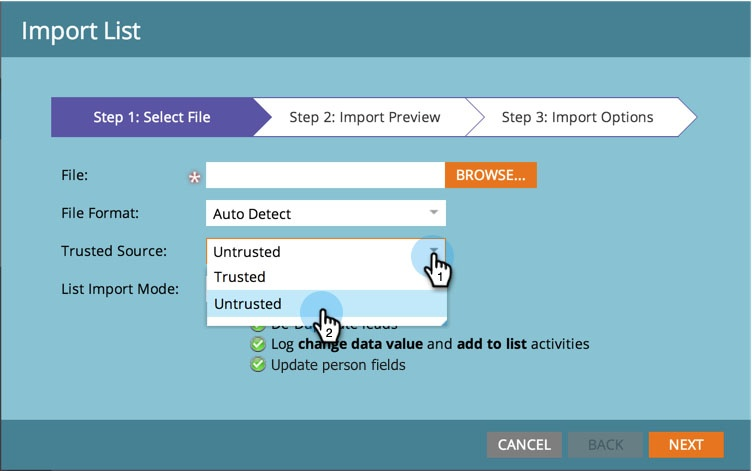

# 信頼できないソースからのリストインポート中に、フィールドの更新をブロック {#block-field-updates-during-list-import-from-untrusted-sources}

一部のリストのデータは、他のリストよりも信頼できます。 疑わしいデータがあり、フィールドが空白の場合はデータを受け入れたいが、既存の値がある場合は受け入れない場合があります。 これは、キーフィールドのフィールド更新をブロックすることで実現できます。

>[!NOTE]
>
>**管理者権限が必要**

## 信頼できないソースからのフィールド更新をブロック {#blocking-field-updates-from-untrusted-sources}

1. 「**[!UICONTROL 管理者]**」領域に移動します。

   

1. 「**[!UICONTROL フィールド管理]**」をクリックします。

   

1. 目的のフィールドを探して選択し、「**[!UICONTROL フィールドアクション]**」で「**[!UICONTROL フィールドの更新をブロック]**」をクリックします。

   

1. 「**[!UICONTROL 信頼できないソースのリストをインポート]**」をチェックし、「**[!UICONTROL 適用]**」をクリックします。

   

>[!TIP]
>
>また、「**[!UICONTROL 信頼できるソースのリストをインポート]**」もチェックすることで、信頼できるリスト、信頼できないリスト、すべてのリストからフィールドを安全に保つことができます。

信頼できないリストから安全に保つその他のフィールドに対して、上記の手順を繰り返します。

## 信頼できないリストのインポートの実行 {#running-an-untrusted-list-import}

1. リストのインポートを実行するにあたり、前の手順で設定したすべてのフィールドを安全にする場合は、必ず「**[!UICONTROL 信頼できない]**」を選択します。

   

リストのインポートの詳しい手順については、[人物のリストのインポート](/help/marketo/getting-started/quick-wins/import-a-list-of-people.md)を参照してください。

キーフィールドが信頼できないリストの読み込みから保護されるようになりました。
