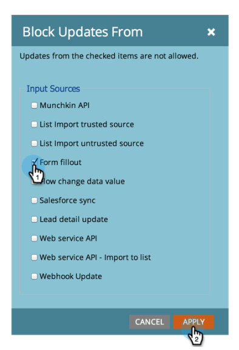

# フィールドの更新のブロック {#block-updates-to-a-field}

フィールドの更新をブロックすると、1 回フィールドに書き込み、フィールドの有効期間内に元の値を保持できます。これは、「[!UICONTROL 人物ソース]」などのフィールドに役立ちます。

>[!NOTE]
>
>**管理者権限が必要**

1. 「**[!UICONTROL 管理者]**」領域に移動します。

   

1. 「**[!UICONTROL フィールド管理]**」をクリックします。

   

1. フィールドを探して選択し、「**[!UICONTROL フィールドアクション]**」で「**[!UICONTROL フィールドの更新をブロック]**」をクリックします。

   

   >[!NOTE]
   >
   >[プログラムメンバーのカスタムフィールド](/help/marketo/product-docs/core-marketo-concepts/programs/working-with-programs/program-member-custom-fields.md)の更新もブロックできます。

1. ブロックする&#x200B;**[!UICONTROL 入力ソース]**&#x200B;を選択し、「**[!UICONTROL 適用]**」をクリックします。

   

   >[!CAUTION]
   >
   >リストのインポートを実行すると、インポートプレビューでブロックされるフィールドのステータスは、_exactly_ に一致するフィールドの名前に基づいて、Marketo がフィールドを自動的に認識した場合にのみ表示されます。フィールドを Marketo フィールドドロップダウンから手動で選択した場合、読み込みプレビューにブロックステータスは表示されませんが、そのフィールドに対する更新ブロックは引き続き実装されます。
