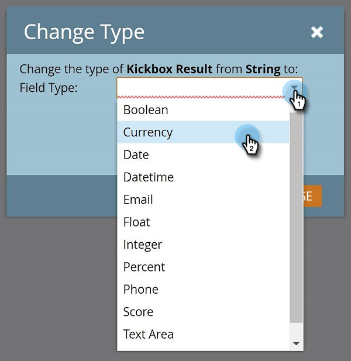

# Marketo カスタムフィールドのタイプの変更&#x200B; {#change-the-type-of-a-marketo-custom-field}

カスタムフィールドのフィールドタイプを変更する方法について説明します。

1. 「**[!UICONTROL 管理者]**」領域に移動します。

   

1. 「**[!UICONTROL フィールド管理]**」をクリックします。

   

1. 目的のフィールドを検索して選択します。

   

1. 「**[!UICONTROL フィールドアクション]**」ドロップダウンで、「**[!UICONTROL タイプを変更]**」をクリックします。

   

1. 新しいタイプを選択します。

   >[!NOTE]
   >
   >スコアおよび数式のフィールドは変更できません。

   

1. 警告を読んで、「**[!UICONTROL 変更]**」をクリックして確定します。

   

   >[!NOTE]
   >
   >表示される警告メッセージは、変更するフィールドの種類によって異なります。

   >[!MORELIKETHIS]
   >
   >[Marketo でのカスタムフィールドの作成](/help/marketo/product-docs/administration/field-management/create-a-custom-field-in-marketo.md)
