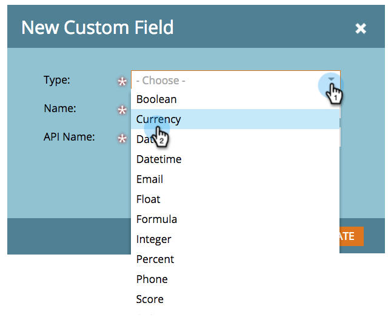

# マーケティング先カスタムフィールドのタイプの変更 {#change-the-type-of-a-marketo-custom-field}

カスタムフィールドのフィールドの種類を変更する方法を次に示します。

1. 「**管理者**」に移動し、「 **フィールド管理**」をクリックします。

   

1. 目的のフィールドを探して選択します。

   

1. 「 **フィールドアクション** 」ドロップダウンで、「タイプの **変更**」をクリックします。

   

1. 新しいタイプを選択します。

   >[!NOTE]
   >
   >スコアフィールドと数式フィールドは変更できません。

   

1. 警告を読み、「**変更**」をクリックして確認します。

   

   >[!NOTE]
   >
   >表示される警告メッセージは、変更の対象となるフィールドの種類によって異なります。

   >[!NOTE]
   >
   >**関連記事**
   >
   >    
   >    
   >    * [Marketorでのカスタムフィールドの作成](create-a-custom-field-in-marketo.md)

カスタムフィールドの種類が変わりました。 ハーレイ！