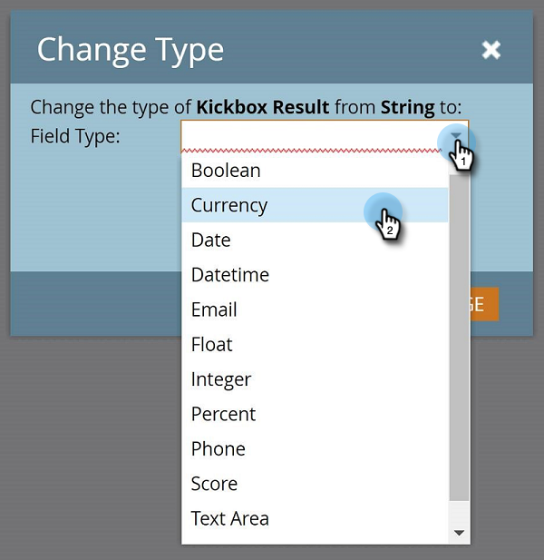

# Marketo カスタムフィールドタイプの変更 {#change-the-type-of-a-marketo-custom-field}

カスタムフィールドのフィールドタイプを変更する方法を次に示します。

1. 「**管理者**」領域に移動します。

   

1. 「**フィールド管理**」をクリックします。

   

1. 目的のフィールドを検索して選択します。

   

1. 「**フィールドアクション**」ドロップダウンで、「**タイプを変更**」をクリックします。

   

1. 新しいタイプを選択します。

   >[!NOTE]
   >
   >スコアおよび数式のフィールドは変更できません。

   

1. 警告を読んで、「**変更**」をクリックして確定します。

   

   >[!NOTE]
   >
   >表示される警告メッセージは、変更元／変更先のフィールドの種類に応じて異なります。

   >[!MORELIKETHIS]
   >
   >[Marketo でのカスタムフィールドの作成](/help/marketo/product-docs/administration/field-management/create-a-custom-field-in-marketo.md)
