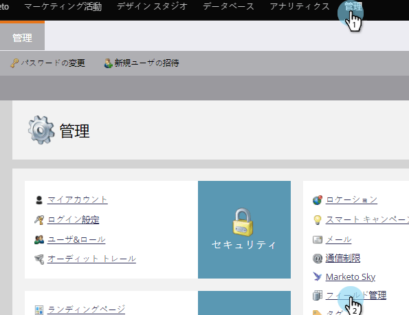

# Marketor {#create-a-custom-field-in-marketo}でのカスタムフィールドの作成

データを保存/取り込むためにMarketoに新しいカスタムフィールドが必要な場合は、次の方法で作成します。

1. 「管理者」に移動し、「フィールド管理」をクリックします。

   

   >[!TIP]
   >
   >CRMと同期させるフィールドは、CRMで作成すると、Marketorに自動的に作成されます。

1. 「新しいカスタムフィールド」をクリックします。

   

1. フィールドの種類を選択します。 これは、Marketoのスマートリストとフォームでのレンダリング方法を変更します。

   >[!TIP]
   >
   >[カスタムフィールドタイプ用語集](custom-field-type-glossary.md)をご覧ください。

   

1. マーケティング担当者に表示する名前を入力します。 API名は自動的に生成されます。 ツイークは可能ですが、一度設定すると名前を変更することはできません。 終了したら「作成」をクリックします。

>[!CAUTION]
>
>フィールド名に次の文字を開始することはできません。**. &amp; +[]**

>[!NOTE]
>
>API名は、SOAP APIおよび他のバックエンドプロセスで使用されます。

フォーム、フローステップ、スマートリストでこのカスタムフィールドを使用できるようになりました。