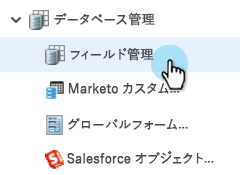
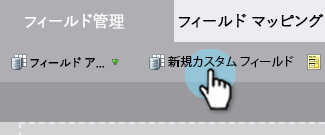
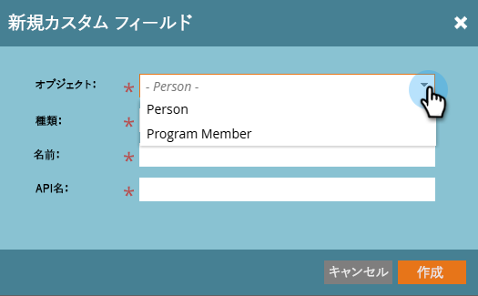
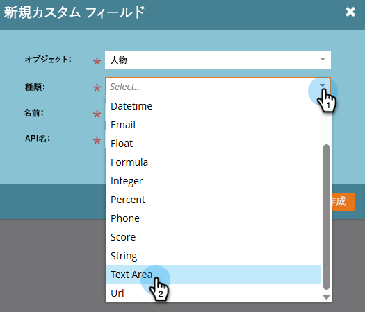

# Marketo でのカスタムフィールドの作成 {#create-a-custom-field-in-marketo}

データを保存または取得するために Marketo で新しいカスタムフィールドが必要な場合は、次の方法で作成します。

1. 「**管理者**」領域に移動します。

   

1. 「**フィールド管理**」をクリックします。

   

   >[!TIP]
   >
   >フィールドを CRM と同期させる場合は、CRM で作成します。これらのフィールドは Marketo で自動的に作成されます。

1. 「**新規カスタムフィールド**」をクリックします。

   

1. 「タイプ」フィールドを選択します。これにより、Marketo のスマートリストおよびフォームでのレンダリング方法が変更されます。

   >[!TIP]
   >
   >[カスタムフィールドタイプ用語集](/help/marketo/product-docs/administration/field-management/custom-field-type-glossary.md)をご覧ください。

   

1. Marketo に表示する名前を入力します。API 名は自動的に生成されます。調整は可能ですが、一度設定すると名前を変更することはできません。終了したら、「**作成**」をクリックします。

>[!CAUTION]
>
>フィールド名の先頭に次の文字を使用することはできません。**.&amp; +[]**

>[!NOTE]
>
>この API 名は、SOAP API および他のバックエンドプロセスで使用されます。

これで、フォーム、フローステップ、スマートリストでこのカスタムフィールドを使用できます。
