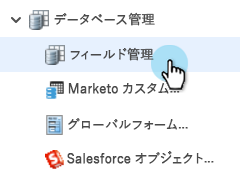
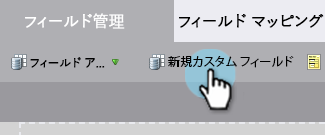
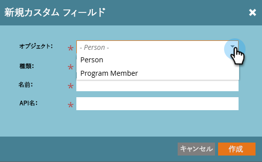
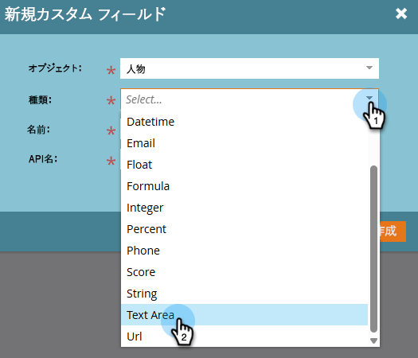

# Marketo でのカスタムフィールドの作成 {#create-a-custom-field-in-marketo}

データを保存または取得するために Marketo Engage で新しいカスタムフィールドが必要な場合は、以下の方法で作成します。

1. 「**[!UICONTROL 管理者]**」領域に移動します。

   

1. 「**[!UICONTROL フィールド管理]**」をクリックします。

   

   >[!TIP]
   >
   >フィールドを CRM と同期させる場合は、CRM で作成します。これらのフィールドは Marketo で自動的に作成されます。

1. 「**[!UICONTROL 新規カスタムフィールド]**」をクリックします。

   

1. 「_[!UICONTROL オブジェクト]_」を選択します。

   

   >[!NOTE]
   >
   >_会社_&#x200B;オブジェクトは自分で選択できませんが、[Marketo サポート](https://nation.marketo.com/t5/support/ct-p/Support){target="_blank"}に連絡してリクエストできます。

1. 「_[!UICONTROL タイプ]_」フィールドを選択します。 これにより、Marketo のスマートリストおよびフォームでのレンダリング方法が変更されます。

   >[!TIP]
   >
   >[カスタムフィールドタイプ用語集](/help/marketo/product-docs/administration/field-management/custom-field-type-glossary.md){target="_blank"}をご覧ください。

   

1. Marketo に表示する&#x200B;_[!UICONTROL 名前]_&#x200B;を入力します（_[!UICONTROL API 名]_&#x200B;は自動的に生成されます）。 保存後は名前を変更できないので、慎重に選択します。 終了したら、「**[!UICONTROL 作成]**」をクリックします。

>[!CAUTION]
>
>フィールド名の先頭に、以下の文字を使用することはできません。**.&amp; +[]**

>[!NOTE]
>
>この API 名は、SOAP API および他のバックエンドプロセスで使用されます。

これで、フォーム、フローステップ、スマートリストでこのカスタムフィールドを使用できます。
