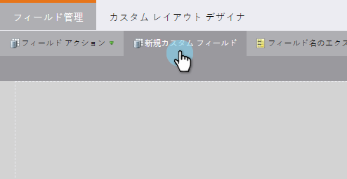
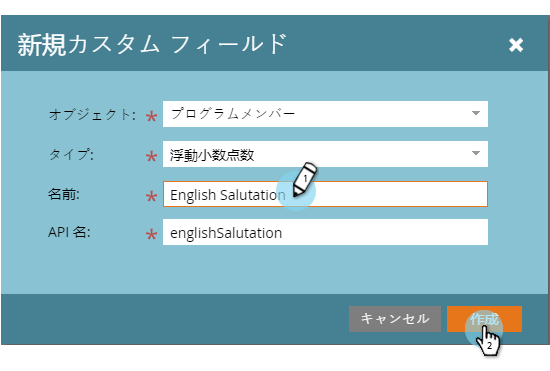

# 連結文字列（数式）フィールドの作成と使用{#create-and-use-a-concatenated-string-formula-field}

複数のフィールドの値を組み合わせたり、マーケティング先の数式フィールドを使用して条件付きの値を作成したりできます。

1. **管理者**&#x200B;に移動し、**フィールド管理**&#x200B;をクリックします。

   

1. 「**新しいカスタムフィールド**」をクリックします。

   

1. 「**式**」を&#x200B;**タイプ**&#x200B;に選択します。

   

1. フィールドに&#x200B;**名前**&#x200B;を入力し、**作成**&#x200B;をクリックします。

   

1. 数式フィールドを探して選択し、[**ルールの編集**]をクリックします。

   

1. 2つ追加の選択肢を選択し、下のスクリーンショットのように定義します。

   

   フローステップ](../../../product-docs/core-marketo-concepts/smart-campaigns/flow-actions/use-tokens-in-flow-steps.md)の[トークンの詳細を表示します。

1. これで、電子メール内で数式フィールドをトークンとして追加できます。

   

お疲れさまでした！ これで、性別に基づいてどの挨拶文を含めるかを知るスマートフィールドが作成されました。 楽しんでクリエイティブになれ。

>[!NOTE]
>
>数式フィールドは、ランディングページ、電子メール、スマートリスト列で使用できます。書き出されません。 数式フィールドを含む電子メールはバッチキャンペーンで送信できません

