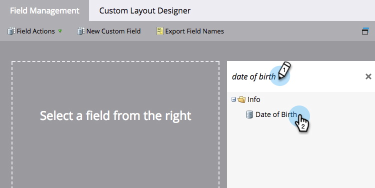

# リストのインポートのフィールドエイリアスの編集 {#edit-field-aliases-for-list-import}

不明なヘッダーを含むリストを読み込む場合は、フィールドエイリアスを作成して、今後の読み込みを簡素化できます。 フィールド管理でこれらのエイリアスを編集することもできます。

>[!NOTE]
>
>**管理者権限が必要**

1. 「**[!UICONTROL 管理者]**」領域に移動します。

   

1. 「**[!UICONTROL フィールド管理]**」をクリックします。

   

1. エイリアスを追加するフィールドを検索して選択します。

   

1. 「**[!UICONTROL フィールドアクション]**」ドロップダウンで、「**[!UICONTROL インポートエイリアスを編集]**」をクリックします。

   

1. エイリアスを入力し、「**[!UICONTROL 保存]**」します。

   

>[!TIP]
>
>必要に応じて、「**[!UICONTROL さらに追加]**」をクリックして、さらにエイリアスを入力します。

これで、「DOB」という名前の列を含むスプレッドシートを読み込むと、Marketoは自動的に「生年月日」として認識し、データを正しいフィールドに読み込みます。

