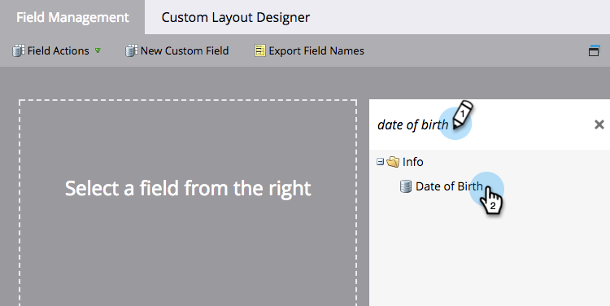

# リストのインポートのフィールドエイリアスの編集 {#edit-field-aliases-for-list-import}

不明なヘッダーを含むリストをインポートする場合、フィールドのエイリアスを作成して、処理を簡単にすることができます。これらのエイリアスは、フィールド管理でも編集できます。ご確認ください。

>[!NOTE]
>
>**管理者権限が必要**

1. 「**管理者**」領域に移動します。

   

1. 「**フィールド管理**」をクリックします。

   

1. エイリアスを追加するフィールドを検索して選択します。

   

1. 内 **フィールドアクション** ドロップダウンで、 **インポート別名の編集**.

   

1. エイリアスを入力し、「**保存**」します。

   

>[!TIP]
>
>必要に応じて、「**さらに追加**」をクリックして、さらにエイリアスを入力します。

確認してみてください。「DOB」という名前の列を持つスプレッドシートを読み込むと、Marketo は自動的に「生年月日」と認識し、データを正しいフィールドに読み込みます。

