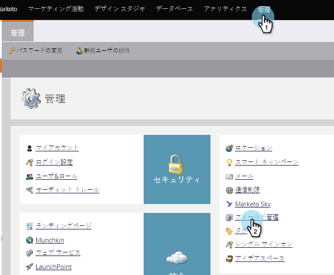

# すべてのMarketor APIフィールド名のリストのエクスポート{#export-a-list-of-all-marketo-api-field-names}

SOAP APIまたはMunchkin APIを使用している場合は、すべてのフィールドとAPI名のリストが必要です。 このリストの入手方法を示します。

>[!NOTE]
>
>**必要な管理者権限**

1. **管理者**&#x200B;に移動し、**フィールド管理**&#x200B;をクリックします。

   

1. 「**フィールド名を書き出し**」をクリックして、スプレッドシートをダウンロードします。

   

ナイス！ これで、すべてのフィールドとAPI名のリストを含むスプレッドシートが作成されました。

>[!NOTE]
>
>MLM API名の文字制限は255です。
