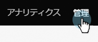
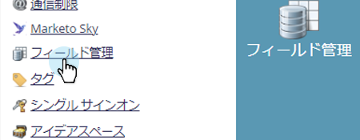

# すべてのオブジェクトメタデータのエクスポート {#export-all-object-metadata}

この機能を使用すると、すべてのオブジェクトとそのメタデータをエクスポートできます。

>[!NOTE]
>
>**管理者権限が必要**

## オブジェクト {#objects}

* リードフィールド（人物／会社）
* Marketo カスタムオブジェクト
* 標準アクティビティ
* カスタムアクティビティ
* チャネル
* タグ

## オブジェクトメタデータのエクスポート {#export-object-metadata}

1. My Marketo で、「**管理者**」をクリックします。

   

1. 「**フィールド管理**」を選択します。

   

1. 「**すべてのオブジェクトをエクスポート**」をクリックします。

   

>[!NOTE]
>
>ブラウザーが Marketo からのポップアップをブロックしていないことを確認します。

データは CSV としてエクスポートされます。

