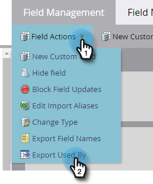

# フィールドの使用先データのエクスポート {#export-used-by-data-for-a-field}

管理者は、フィールドの関連アセットを書き出して、リンク解除をチームに委任できます。

>[!NOTE]
>
>**管理者権限が必要**

1. 「**[!UICONTROL 管理者]**」領域に移動します。

   

1. 「**[!UICONTROL フィールド管理]**」をクリックします。

   

1. 目的のフィールドを見つけて選択します。

   

1. **[!UICONTROL フィールドアクション]**&#x200B;ドロップダウンをクリックして、**[!UICONTROL 使用先をエクスポート]**&#x200B;を選択します。

   

1. [!DNL Excel] ファイルの書き出し。 コンテンツを表示するには、ファイルを開きます。

   

   >[!TIP]
   >
   >各関連アセットはリンクになっており、クリックすると Marketo で開きます。
