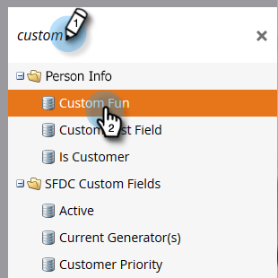

# メールでの HTML エンコードトークン {#html-encode-tokens-in-emails}

メールで使用されるユーザートークンと会社トークンを有効／無効にします。

>[!NOTE]
>
>**管理者権限が必要**

>[!NOTE]
>
>エンコーディングでは送信時の混乱を防ぐために文字が HTML コードのバージョンに変換されます（例：「&amp;」は `&amp;` に変換）。詳しくは、Web デベロッパーにお問い合わせください。

1. 「**[!UICONTROL 管理者]**」領域に移動します。

   

1. 「**[!UICONTROL フィールド管理]**」をクリックします。

   

1. 目的のフィールドを検索して選択します。

   

1. 有効にするには「**[!UICONTROL メールでの HTML エンコード]**」トークンボックスをオンにし、無効にするにはオフにします。

   

   これで完了です。個々のフィールドに対して必要なだけ繰り返します。
