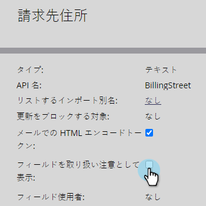

# フィールドを機密としてマークする {#mark-a-field-as-sensitive}

Marketo の管理者は、特定のフィールドを「機密」としてマークできます。値がフォームに事前入力されることがないので、ユーザーの機密データを保護できます。

>[!NOTE]
>
>この機能は、5月11日（火）（PT）の夜に、すべての Marketo インスタンスで有効になります。

1. 「**管理者**」をクリックします。

   

1. 「**フィールド管理**」をクリックします。

   

1. 目的のフィールドを検索して選択します。

   

1. 「**フィールドを機密としてマークする**」チェックボックスを選択します。

   

これで完了です。今後、事前入力が有効になっている Marketo のフォームに、選択したフィールドのデータが表示されなくなります。
