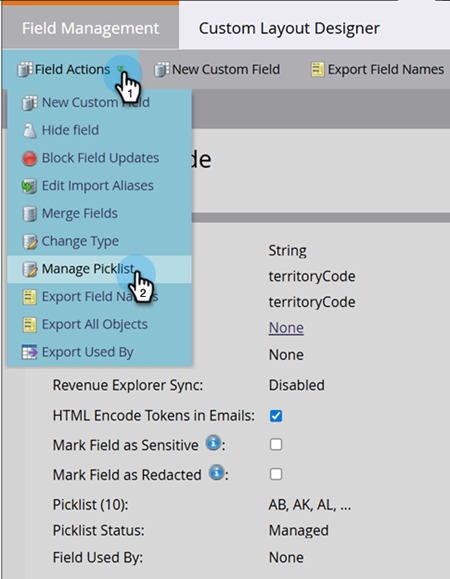

# ピックリスト管理 {#picklist-management}

ピックリスト管理を使用すると、フィールドの固定値セットを定義して、Marketo Engage内のデータとワークフロー管理を簡素化できます。 Marketoでは、定義されたピックリストを持つCRM フィールドにマッピングされていない非テキストフィールドのみを管理できます。 フィールドが定義されたピックリストを持つCRM フィールドにマッピングされる場合、そのフィールドの値はCRMで定義する必要があります。

フィールド管理ページからピックリストのステータスを確認できます。 フィールドには、次のいずれかのピックリストステータスが設定されている場合があります。

* **Managed**: ユーザーがこのフィールドに対して自動提案できる値のセットを定義しました。 フィールド管理で定義された値のみが自動提案されます。 管理されたピックリストが削除されると、ピックリストのステータスは、「管理されていない」または「シード済み」フィールドの初期値に戻ります。

* **管理対象外**：このフィールドの可能な値が定義されていません。 値は、データベース内のフィールドに存在する値に基づいて自動的に提案されます。

* **Seeded**: フィールドには、ユーザーに提案されるシステム定義の値のリストがあります。

* **CRM**: フィールドの値は、CRM システム Salesforce.comまたはMicrosoft Dynamicsによって定義され、インスタンスに同期されます。

  

## ピックリストを管理 {#manage-picklist}

フィールドの値を変更するには、**管理者** > **フィールド管理**&#x200B;に移動し、目的のフィールドを選択します。

_フィールドアクション_ ドロップダウンをクリックし、**ピックリストの管理**&#x200B;を選択します。

_ピックリストを管理_ ダイアログで、値を追加、編集、または削除できます。 また、管理対象ピックリストを削除して、フィールドを元のピックリストの状態（_管理対象外_&#x200B;または&#x200B;_シード_）に戻すこともできます。

各ピックリストエントリには、表示値と送信済み値があります。 表示値は、スマートリスト、スマートキャンペーン、またはフォームを作成する際にユーザーに提案される値で、送信された値は保存される値です。 例えば、地域コードのユースケースでは、2文字のコード（AB）を保存しながら、地域のフルネーム（Albertaなど）を提案する場合があります。

## 自動提案 {#autosuggest}

「_管理対象ピックリスト_」設定が有効になっている場合、フィルター、フローステップの選択、データ値の変更の各ステップは、管理対象ピックリストから値を自動的に提案します。 この設定を無効にすると、管理されていない値のみが提案されます。

### 管理ピックリストと非管理ピックリストの切り替え {#switching}

ほとんどのMarketo Engage サブスクリプションには、Managed Picklistsの導入前のデータが含まれています。 スマートリストの値を使用するか、この管理されていないバージョン選択リストのフローステップ（例：データベースのレコードに存在する完全な値セットから）を使用するには、スマートリストまたはキャンペーンビューで「管理された選択」設定を切り替えます。 オンに切り替えると、管理されたピックリストの値のみが表示されます。 オフにすると、管理されていないピックリストが使用され、データベース内の既存の値に基づいて値が自動的に提案されます。

## フォームピックリスト（テキストフィールドを選択） {#form-picklists}

シード済みピックリストやCRM管理のピックリストと同様に、「選択」フィールドタイプを使用すると、「管理ピックリスト」の値がFormsに反映されます。 管理対象ピックリストを含むフィールドの場合は、そのフィールドを選択し、「フィールドタイプ」を&#x200B;_選択_&#x200B;に設定します。

これは、そのフィールドに定義された管理対象ピックリスト値のセットを示しています。

