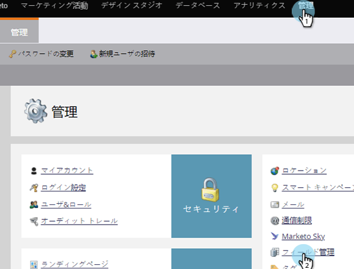

# フィールド名の変更{#rename-a-field}

>[!NOTE]
>
>Marketoでは、カスタムフィールドの名前を変更できますが、1つのキャッチがあります。削除する前に、システムでの使用をすべて削除する必要があります。 フォーム、スマートリスト、スマートキャンペーンが含まれます。

>[!NOTE]
>
>**必要な管理者権限**

1. 「管理者」に移動し、「フィールド管理」をクリックします。

   

1. 名前を変更するフィールドを見つけて選択し、キャンバスでフィールド名をクリックします。

   >[!TIP]
   >
   >「**使用者**」リンクをクリックして、このフィールドを参照するアセットを検索します。

   

1. フィールドの名前を変更し、「保存」をクリックします。

   

いい仕事！ これで、Marketoのフィールド名を変更する方法がわかりました。

>[!CAUTION]
>
>SalesforceでAPI名を変更すると、Marketorは新しいフィールドを作成し、古いフィールドは残します。

