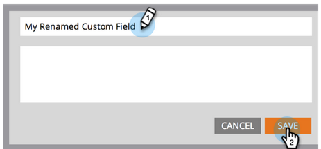

# フィールドの名前を変更する {#rename-a-field}

>[!NOTE]
>
>Marketo でのカスタムフィールドの名前変更は可能ですが、注意しなければならないのは、その前に、システムでの使用をすべて削除する必要があるということです。これにはフォーム、スマートリスト、スマートキャンペーンが該当します。

>[!NOTE]
>
>**管理者権限が必要**

1. 「**管理者**」領域に移動します。

   

1. 「**フィールド管理**」をクリックします。

   

1. 名前変更するフィールドを探して選択し、キャンバスでフィールド名をクリックします。

   

   >[!TIP]
   >
   >「**使用者**」リンクをクリックして、このフィールドを参照するアセットを検索します。

1. フィールドの名前を変更し、「**保存**」をクリックします。

   

できましたね。これで、Marketo でフィールドを名前変更する方法がわかりました。

>[!CAUTION]
>
>Salesforce で API 名を変更すると、Marketo は新しいフィールドを作成し、古いフィールドはそのままにします。
