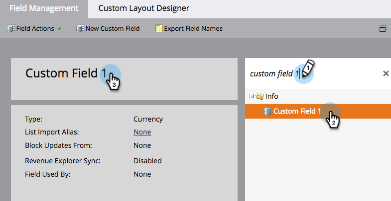

# フィールドの名前を変更する {#rename-a-field}

>[!NOTE]
>
>Marketo でのカスタムフィールドの名前変更は可能ですが、注意しなければならないのは、その前に、システムでの使用をすべて削除する必要があるということです。これにはフォーム、スマートリスト、スマートキャンペーンが該当します。

>[!NOTE]
>
>**管理者権限が必要**

1. 「**[!UICONTROL 管理者]**」領域に移動します。

   

1. 「**[!UICONTROL フィールド管理]**」をクリックします。

   

1. 名前変更するフィールドを探して選択し、キャンバスでフィールド名をクリックします。

   

   >[!TIP]
   >
   >「**[!UICONTROL 使用者]**」リンクをクリックして、このフィールドを参照するアセットを検索します。

1. フィールドの名前を変更し、「**[!UICONTROL 保存]**」をクリックします。

   

できましたね。これで、Marketo でフィールドを名前変更する方法がわかりました。

>[!CAUTION]
>
>[!DNL Salesforce] で API 名を変更すると、Marketoによって新しいフィールドが作成され、古いフィールドは残されます。
