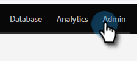

# Marketo と [!DNL Salesforce] の間のフィールドマッピングの表示 {#view-field-mappings-between-marketo-and-salesforce}

特定のMarketo フィールドがどの[!DNL Salesforce] フィールドにマッピングされているかを知る必要がある場合があります。 次の手順に従います。

>[!NOTE]
>
>**管理者権限が必要**

1. 「**[!UICONTROL 管理者]**」領域に移動します。

   

1. 「**[!UICONTROL フィールド管理]**」をクリックします。

   

1. 表示するフィールドを見つけ、**+**&#x200B;をクリックしてマッピングを展開します。

   

>[!NOTE]
>
>ラベル名ではなく、[!DNL Salesforce] API名が表示されます。

>[!IMPORTANT]
>
>リストされるフィールドは、初期マッピングのデータのみを反映しています。 Marketo/[!DNL Salesforce] シンク後に更新されません。
