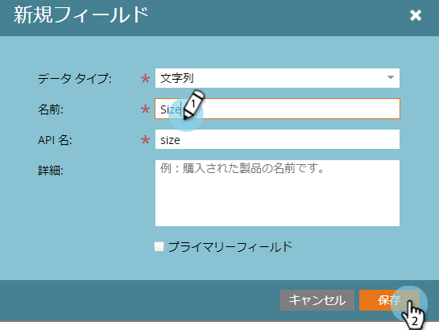
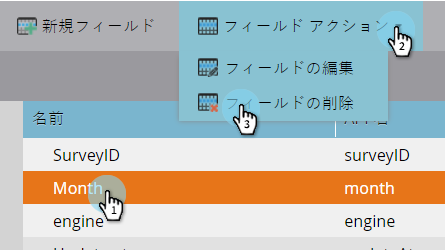

# Marketo のカスタムアクティビティフィールドの追加／編集／削除 {#add-edit-delete-marketo-custom-activity-fields}

カスタムアクティビティフィールドの追加、変更、削除が必要になる場合があります。手順は以下のとおりです。

## カスタムアクティビティフィールドの追加 {#add-a-custom-activity-field}

1. 「Marketo カスタムアクティビティ」で、「**フィールド**」をクリックします。

   

1. フィールドを追加するカスタムアクティビティを選択します。

   

1. 「**新しいフィールド**」をクリックします。

   

1. フィールドのデータタイプを選択します。

   

   >[!TIP]
   >
   >何を選択してよいかわからなくても、心配はありません。使用可能なすべてのデータタイプは、[この記事](/help/marketo/product-docs/administration/field-management/custom-field-type-glossary.md)に定義されています。

1. フィールドに名前を付けます。「API 名」には自動的に値が入力されます。完了したら、「**保存**」をクリックします。

   

   これで完了です。新しいフィールドが追加されました。

## カスタムアクティビティフィールドの編集 {#edit-a-custom-activity-field}

1. 「Marketo カスタムアクティビティ」で、「**フィールド**」をクリックします。

   

1. 編集するフィールドが含まれているカスタムアクティビティを選択します。

   

1. 編集するフィールドを選択し、「**フィールドアクション**」ドロップダウンをクリックして、「**フィールドを編集**」を選択します。

   

   フィールドを編集ポップアップが表示されます。この例では、フィールドの名前を変更します。

   

1. 新しい「名前」と「API 名」を入力し、「**保存**」をクリックします。

   

   >[!NOTE]
   >
   >フィールドの編集時には、API 名は自動入力されません。フィールド名と API 名は一致する必要はありませんが、一致することをお勧めします。

   >[!CAUTION]
   >
   >API 名の編集や、カスタムアクティビティが公開されていない場合のみ、フィールドを「プライマリ」に変更できます。アクティビティが既に公開されている場合は、フィールドの名前と説明（オプション）のみを編集できます。

   >[!NOTE]
   >
   >プライマリフィールドを変更する場合は、まず既存のフィールドを選択削除する必要があります。

フィールドが編集されました。

## カスタムアクティビティフィールドの削除 {#delete-a-custom-activity-field}

1. 「Marketo カスタムアクティビティ」で、「**フィールド**」をクリックします。

   

1. 削除するフィールドを含むカスタムアクティビティを選択します。

   

1. 削除するフィールドを選択し、「**フィールドアクション**」ドロップダウンをクリックして、「**フィールドを削除**」を選択します。

   

   簡単ですね。
