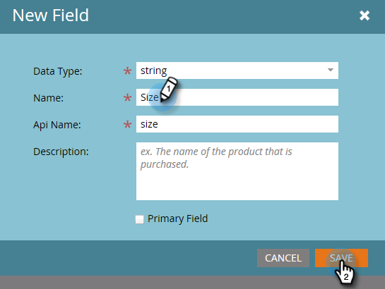

# Marketo カスタムアクティビティフィールドの追加、編集、削除 {#add-edit-delete-marketo-custom-activity-fields}

カスタムアクティビティフィールドを追加、変更、削除する方法について説明します。

## カスタムアクティビティフィールドの追加 {#add-a-custom-activity-field}

1. 「**[!UICONTROL 管理者]**」領域に移動します。

   

1. 「**[!UICONTROL Marketo カスタムアクティビティ]**」をクリックします。

   

1. 「**[!UICONTROL フィールド]**」をクリックします。

   

1. フィールドを追加するカスタムアクティビティを選択します。

   

1. 「**[!UICONTROL 新しいフィールド]**」をクリックします。

   

1. フィールドの[!UICONTROL データタイプ]を選択します。

   

   >[!TIP]
   >
   >使用可能なすべてのデータタイプの定義については、[この記事](/help/marketo/product-docs/administration/field-management/custom-field-type-glossary.md)を参照してください。

1. フィールドに名前を付けます。 [!UICONTROL API名]が自動入力されます。 完了したら、「**[!UICONTROL 保存]**」をクリックします。

   

   新しいフィールドが追加されました。

## カスタムアクティビティフィールドの編集 {#edit-a-custom-activity-field}

1. 「**[!UICONTROL 管理者]**」領域に移動します。

   

1. 「**[!UICONTROL Marketo カスタムアクティビティ]**」をクリックします。

   

1. 「**[!UICONTROL フィールド]**」をクリックします。

   

1. 編集するフィールドが含まれているカスタムアクティビティを選択します。

   

1. 編集するフィールドを選択し、**[!UICONTROL フィールドアクション]**&#x200B;ドロップダウンをクリックして、**[!UICONTROL フィールドを編集]**&#x200B;を選択します。

   

   **[!UICONTROL フィールドを編集]**&#x200B;ポップアップが表示されます。 この例では、フィールド名を変更しています。

   

1. 新しい名前と[!UICONTROL API名]を入力し、**[!UICONTROL 保存]**&#x200B;をクリックします。

   

   >[!NOTE]
   >
   >フィールドの編集時に[!UICONTROL API名]は自動入力されません。 フィールド [!UICONTROL Name]と[!UICONTROL API Name]が一致する必要はありませんが、Marketoでは一致することを推奨しています。

   >[!CAUTION]
   >
   >カスタムアクティビティが公開されていない場合にのみ、[!UICONTROL API名]を編集するか、フィールドをプライマリに変更できます。

   >[!NOTE]
   >
   >プライマリフィールドを変更する場合は、まず既存のフィールドを選択削除する必要があります。

フィールドが更新されました。

## カスタムアクティビティフィールドの削除 {#delete-a-custom-activity-field}

1. 「**[!UICONTROL 管理者]**」領域に移動します。

   

1. 「**[!UICONTROL Marketo カスタムアクティビティ]**」をクリックします。

   

1. 「**[!UICONTROL フィールド]**」をクリックします。

   

1. 削除するフィールドを含むカスタムアクティビティを選択します。

   

1. 削除するフィールドを選択し、**[!UICONTROL フィールドアクション]**&#x200B;ドロップダウンをクリックして、**[!UICONTROL フィールドを削除]**&#x200B;を選択します。

   
