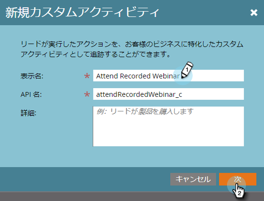

# カスタムアクティビティの作成 {#create-a-custom-activity}

新しいカスタムアクティビティを作成するには、次の手順に従います。

>[!NOTE]
>
>ほとんどの購読には、割り当てられるカスタムアクティビティタイプ数が10個に制限されています。

1. 「 **管理者**」をクリックします。

   

1. 「 **Database Management** 」で、「 **Customアクティビティ**」をクリックします。

   

1. 「 **新規カスタムアクティビティ**」をクリックします。

   

1. 名前と説明（任意）を入力し、「 **次へ**」をクリックします。 API名は自動入力されますが、カスタマイズすることができます。

   

   >[!CAUTION]
   >
   >API名を変更する場合は、名前が他のカスタムアクティビティ内のフィールドと競合しないことを確認してください。

1. 「 **フィルター** 」と「 **トリガー** 」を定義し、「 **次へ**」をクリックします。

   

1. 主フィールドに、カスタムアクティビティの目的を要約した名前を付けます。

   

   それだ！

>[!NOTE]
>
>**関連記事**
>
>* [カスタムアクティビティについて](understanding-custom-activities.md)

>

