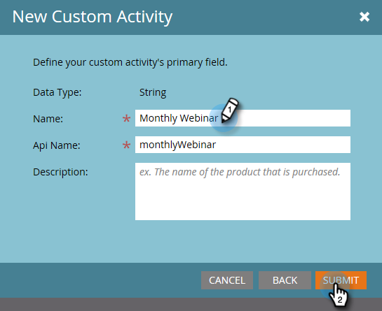

# カスタムアクティビティの作成 {#create-a-custom-activity}

新しいカスタムアクティビティを作成する手順は、以下のとおりです。

>[!NOTE]
>
>ほとんどのサブスクリプションには、カスタムアクティビティタイプは 10 個までという制限が割り当てられています。

1. 「**[!UICONTROL 管理者]**」領域に移動します。

   

1. 「**[!UICONTROL Marketo カスタムアクティビティ]**」をクリックします。

   

1. 「**[!UICONTROL 新規カスタムアクティビティ]**」をクリックします。

   

1. 名前と（オプションで）[!UICONTROL 説明]を入力し、「**[!UICONTROL 次へ]**」をクリックします。API 名は自動入力されますが、カスタマイズできます。

   

   >[!CAUTION]
   >
   >[!UICONTROL API 名 ] を変更する場合は、その名前が他のカスタムアクティビティのフィールドと競合していないことを確認します。

1. 「[!UICONTROL フィルター]」および「[!UICONTROL トリガー]」を定義し、「**[!UICONTROL 次へ]**」をクリックします。

   

1. カスタムアクティビティの目的を要約した **[!UICONTROL 名前]** をプライマリフィールドに入力します。

   

>[!MORELIKETHIS]
>
>[カスタムアクティビティについて](/help/marketo/product-docs/administration/marketo-custom-activities/understanding-custom-activities.md)
