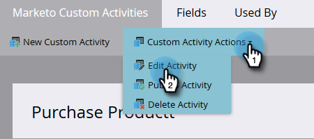

# カスタムアクティビティの編集 {#edit-a-custom-activity}

作成済みのカスタムアクティビティに変更を加える必要がある場合、手順は以下のとおりです。

1. 「**[!UICONTROL 管理者]**」領域に移動します。

   

1. 「**[!UICONTROL Marketo カスタムアクティビティ]**」をクリックします。

   

1. 編集するカスタムアクティビティを選択します。

   

1. 「**[!UICONTROL カスタムアクティビティアクション]**」をクリックし、「**[!UICONTROL アクティビティを編集]**」を選択します。

   

   アクティビティタイプを編集が表示されます。この例では、タイポを修正します。

   

1. 新しい情報を入力し、「**[!UICONTROL 送信]**」をクリックします。

   

   カスタムアクティビティが編集されました。

   >[!NOTE]
   >
   >編集時にアクティビティがドラフトだった場合、そのアクティビティはドラフトのままです。公開された場合、ステータスは「ドラフトで公開」に変わります。
