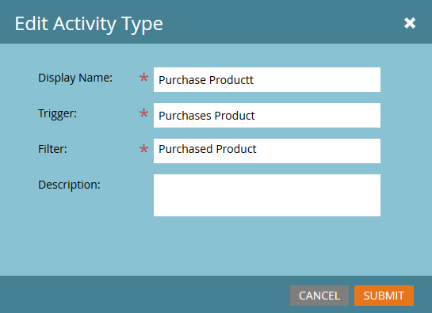

# カスタムアクティビティの編集 {#edit-a-custom-activity}

作成済みのカスタムアクティビティを変更するには、次の手順に従います。

1. 「**[!UICONTROL 管理者]**」領域に移動します。

   

1. 「**[!UICONTROL Marketo カスタムアクティビティ]**」をクリックします。

   

1. 編集するカスタムアクティビティを選択します。

   

1. 「**[!UICONTROL カスタムアクティビティアクション]**」をクリックし、「**[!UICONTROL アクティビティを編集]**」を選択します。

   

   アクティビティタイプを編集が表示されます。 この例では、タイプミスが修正されています。

   

1. 更新された情報を入力し、**[!UICONTROL 送信]**&#x200B;をクリックします。

   

   カスタムアクティビティが更新されました。

   >[!NOTE]
   >
   >編集時にアクティビティがドラフトだった場合、そのアクティビティはドラフトのままです。 公開された場合、ステータスは「ドラフトで公開」に変わります。
